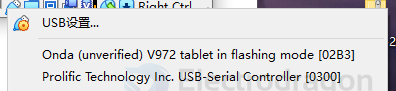
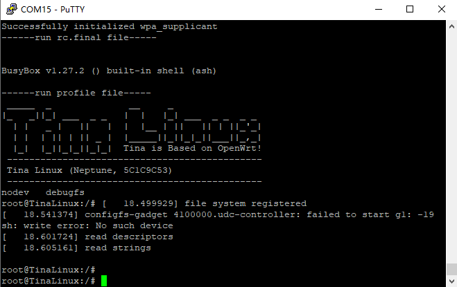

# F133-SDK-dat

- [[sunxi-log-dat]] - [[F133-boot-log-dat]]

- [[sunxi-dat]] - [[sunxi-tools-dat]]

## bootsel 

- SPI_MOSI
- SPI_MISO

## flash load on 

- [[virtualbox-dat]]

hold down fel button and press reset to enter into fel mode 

## F133-boot 

插入烧写好的TF卡，使用串口连接，

- PE2接串口RX，
- PE3接串口TX。

接入5V供电，如果使用屏幕建议插入TYPE-C线，防止电流不足。

[[serial-dat]] - 波特率115200

- [[linux-dat]]

- [[display-sdk-dat]]

## SDK 

- [Allwinner SDK](https://github.com/allwinner-zh/Allwinner-RTOS)

- [[sunxi-tools-dat]]

sudo sunxi-fel -l

    Warning: no 'soc_sram_info' data for your SoC (id=1859)
    USB device 002:003   Allwinner 0x1859  

- The tool (e.g. `sunxi-fel`) does not recognize the SoC with ID `0x1859`.
- It lacks **SRAM layout data** (`soc_sram_info`) for this SoC.
- Likely causes:
  - Using a **new or uncommon Allwinner SoC** (e.g., F133, V853).
  - Using an **outdated version** of the tool.

Could use https://etcher.balena.io/#download-etcher for flash image to SD card.

## image 

https://github.com/Edragon/allwinner-F133

image == https://github.com/ylyamin/allwinner_d1_hal

https://github.com/YuzukiHD/Buildroot-YuzukiSBC

- image flash tools - [[allwinner-sdk-dat]] - https://github.com/Edragon/allwinner-tools

## ref 

- [[F133-dat]]