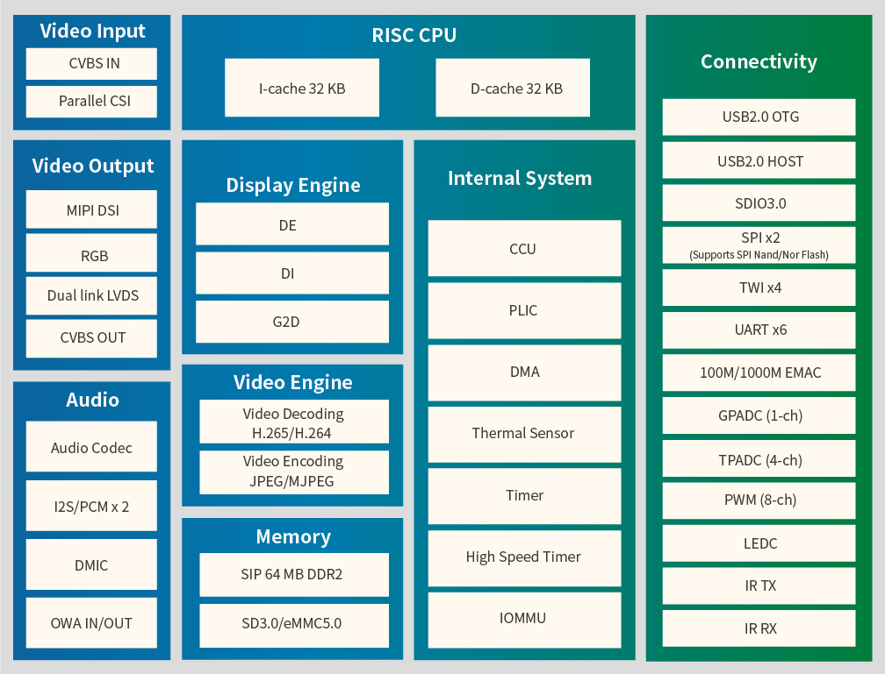
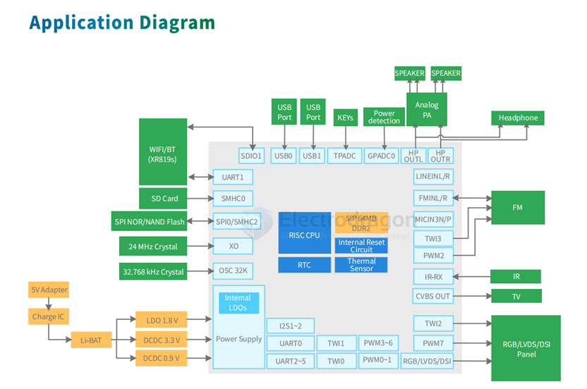
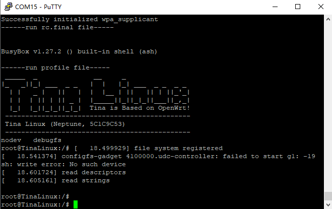

# F133-dat

- [[allwinner-dat]] - [[allwinner-D1-dat]] - [[D1-S-dat]] - [[D1-H-dat]]

- [[allwinner-sdk-dat]]

D1S == F133 == C906 

## selection 

F133 is essentially a rebranded D1s, also known as V851s, targeting AI camera and audio/video applications.

Both have 64-bit RISC-V cores (C906) and basic NPU, but F133/V851s is bundled with camera-optimized SDKs, especially for face recognition and object detection tasks.

If you're building a general-purpose Linux-based RISC-V board: D1s is the term used.

If you're building a smart camera or want Allwinner's AI SDKs: F133/V851s is preferred.

## Allwinner F133 (D1S) Main Features

### Overview

- High-performance display processor
- Also known as D1S
- 64-bit RISC-V architecture (C906 core)
- Supports H.265 decoding up to 1080p@60fps and G2D rotation
- Supports RGB/LVDS/MIPI mainstream display interfaces, up to 1920x1080@60fps
- Simultaneous output to screen and analog video signal

---

### CPU

- RISC-V 64-bit CPU
- 32 KB I-cache + 32 KB D-cache

---

### Memory

- SIP 64 MB DDR2
- SD3.0 / eMMC 5.1
- SPI Nor / NAND Flash

---

### Video Engine

**Decoding:**
- H.265 up to 1080p@60fps
- H.264 up to 1080p@60fps
- MPEG-1/2/4, JPEG, VC1 up to 1080p@60fps

**Encoding:**
- JPEG / MJPEG up to 1080p@60fps
- Supports input picture scaler (up/down)

---

### Display Engine

- Allwinner SmartColor2.0 post-processing for enhanced display quality
- Supports de-interlace (DI) up to 1080p@60fps
- G2D hardware accelerator: rotate, mixer, lbc decompression

---

### Video Output

- CVBS OUT interface (NTSC and PAL formats)
- RGB LCD output interface up to 1920x1080@60fps
- Dual-link LVDS interface up to 1920x1080@60fps

---

### Video Input

- 8-bit parallel CSI interface
- CVBS IN interface (NTSC and PAL formats, only for F133-B)

## application diagram 

- [[RISC-V-dat]]

- [[EA3036-dat]] - [[memory-dat]] - [[microsd-dat]]

- [[PCIE-dat]] - [[crystal-dat]]

- [[FPC-dat]] - [[switch-dat]]

- [[wifi-dat]]

datasheet - [[F133_Datasheet_V1.0_whycan.pdf]]

## flash 

- [[sunxi-tools-dat]]

## version 

- F133-A == TQFP-128-EP(14x14)
- F133-B == ELQFP-128(14x14)

## bootsel 

- SPI_MOSI
- SPI_MISO

## boards 

- dongshanpi == https://github.com/DongshanPI/Awesome_RISCV-AllwinnerD1

- https://linux-chenxing.org/infinity2/dongshanpione/

## SDK 

- [Allwinner SDK](https://github.com/allwinner-zh/Allwinner-RTOS)

- [[sunxi-tools-dat]]

sudo sunxi-fel -l

    Warning: no 'soc_sram_info' data for your SoC (id=1859)
    USB device 002:003   Allwinner 0x1859  

- The tool (e.g. `sunxi-fel`) does not recognize the SoC with ID `0x1859`.
- It lacks **SRAM layout data** (`soc_sram_info`) for this SoC.
- Likely causes:
  - Using a **new or uncommon Allwinner SoC** (e.g., F133, V853).
  - Using an **outdated version** of the tool.

Could use https://etcher.balena.io/#download-etcher for flash image to SD card.

image == https://github.com/ylyamin/allwinner_d1_hal

## F133-boot 

插入烧写好的TF卡，使用串口连接，

- PE2接串口RX，
- PE3接串口TX。

接入5V供电，如果使用屏幕建议插入TYPE-C线，防止电流不足。

[[serial-dat]] - 波特率115200

- [[linux-dat]]

- [[display-sdk-dat]]

## extend 

- [[oled-dat]] - [[amoled-dat]] - [[display-dat]] 

- [[camera-dat]] - [[DVP-display-dat]] 

## SCH 

.png)

[开发板原理图 DongshanPI-D1s_SCH-V2.pdf](https://dongshanpi.com/DongshanPI-D1s/DongshanPI-D1s_SCH-V2.pdf)

## ref 

- [[mini-pcie-dat]]

- [[F133-dev]]

- [[virtualbox-dat]]

- [[PCB-dat]]

- [[dongshanpi-dat]]

- [[F133]] - [[allwinner]]

- [[memory-dat]] - [[flash-dat]]

- [[ethernet-dat]]

- [[wifi-dat]] compatible modules == [[RTL8723-dat]]

- [[HDMI-dat]]

- [[USB-dat]]

- [[power-dat]]

- [[audio-dat]]