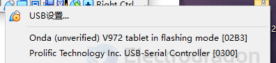

# F133-dat

D1S == F133 == C906 

F133 is essentially a rebranded D1s, also known as V851s, targeting AI camera and audio/video applications.

Both have 64-bit RISC-V cores (C906) and basic NPU, but F133/V851s is bundled with camera-optimized SDKs, especially for face recognition and object detection tasks.

If you're building a general-purpose Linux-based RISC-V board: D1s is the term used.

If you're building a smart camera or want Allwinner's AI SDKs: F133/V851s is preferred.

Allwinner D1s (also known as F133) is based on a RISC-V core, and is a cheaper version of the D1 with the following differences:

- 64 MB of DDR2 memory included in the same package, instead of requiring external memory.
- No Tensilica HiFi4 DSP.
- No HDMI output.
- One less I2S port.

- [[RISC-V-dat]]

- [[EA3036-dat]] - [[memory-dat]] - [[microsd-dat]]

- [[PCIE-dat]] - [[crystal-dat]]

- [[FPC-dat]] - [[switch-dat]]

- [[RTL8723-dat]]

[linux-sunxi.org](https://linux-sunxi.org/D1s)

- [[D1s_User Manual_V1.0.pdf]]

https://d1s.docs.aw-ol.com/

## flash 

## version 

- F133-A == TQFP-128-EP(14x14)
- F133-B == ELQFP-128(14x14)

## SCH 

misc 

## bootsel 

- SPI_MOSI
- SPI_MISO

## boards 

- dongshanpi == https://github.com/DongshanPI/Awesome_RISCV-AllwinnerD1

[开发板原理图 DongshanPI-D1s_SCH-V2.pdf](https://dongshanpi.com/DongshanPI-D1s/DongshanPI-D1s_SCH-V2.pdf)

- https://linux-chenxing.org/infinity2/dongshanpione/

## SDK 

- [Allwinner SDK](https://github.com/allwinner-zh/Allwinner-RTOS)

- [[sunxi-tools-dat]]

sudo sunxi-fel -l

    Warning: no 'soc_sram_info' data for your SoC (id=1859)
    USB device 002:003   Allwinner 0x1859  

- The tool (e.g. `sunxi-fel`) does not recognize the SoC with ID `0x1859`.
- It lacks **SRAM layout data** (`soc_sram_info`) for this SoC.
- Likely causes:
  - Using a **new or uncommon Allwinner SoC** (e.g., F133, V853).
  - Using an **outdated version** of the tool.

Could use https://etcher.balena.io/#download-etcher for flash image to SD card.

image == https://github.com/ylyamin/allwinner_d1_hal

## repo 

## ref 

- [[virtualbox-dat]]

- [[0402-dat]] 

- [[allwinner-dat]]

- [[flash-dat]]

- [[dongshanpi-dat]]

- [[F133]] - [[allwinner]]

- [[memory-dat]]

- [[ethernet-dat]]

- [[HDMI-dat]]

- [[USB-dat]]