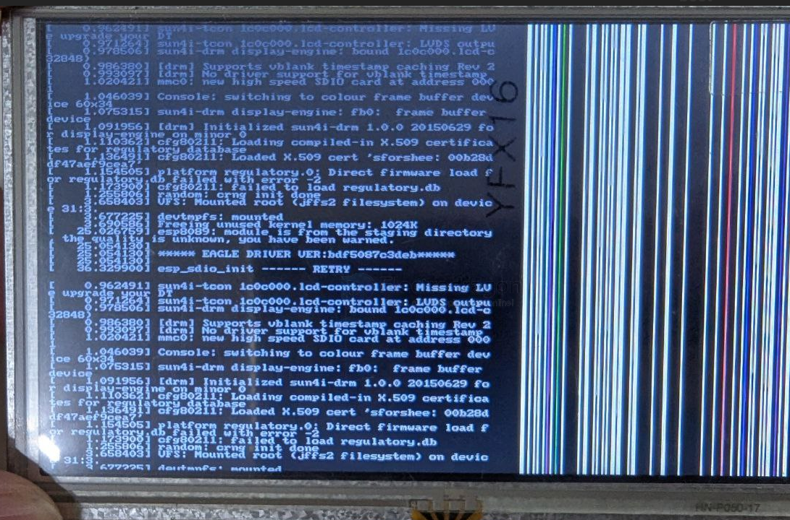
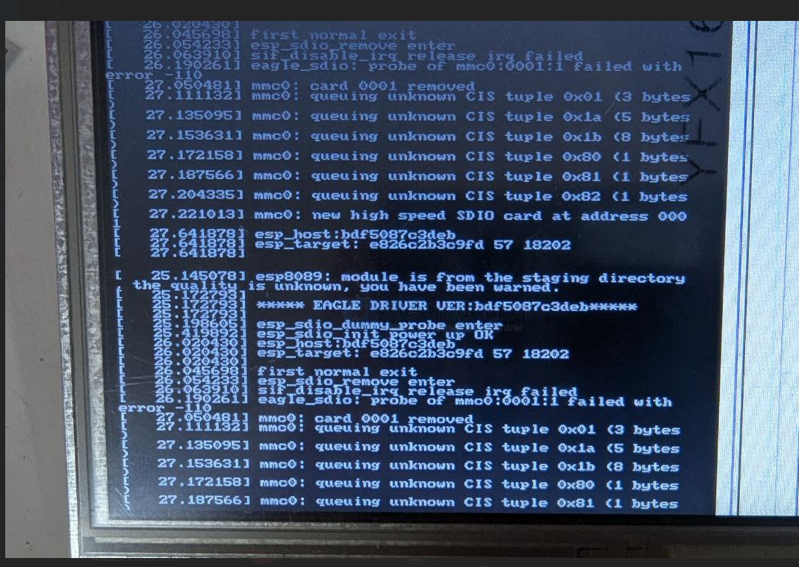

# F1C100-image-dat.md

## boot 

    ***** EAGLE DRIVER USER:bdf5087c3deb *****
    esp_sdio_init ----- RETRY -----

- a problem of the wrong module 

## prebuilt image

### image == Nano_pub_V*.zip

为了让大家上手即食，**Nano_pub_V*.zip** 是我们给出的解决方案。

Nano_pub_V4\image

- Nano_flash_480272.bin
- Nano_flash_800480.bin
- Nano_flash_800480.bin.old
- Nano_flash_800600.bin
- Nanotf480272.dd
- Nano tf8800480.dd
- Nano tf800600.dd
- test.bin

modules\tf\4.15.0-next-20180202-licheepi-nano+

- kernel
- build
- modules.alias
- modules.alias.bin
- modules.builtin
- modules.builtin.bin
- modules.dep
- modules.dep.bin
- modules.devname
- modules.order
- modules.softdep
- modules.symbols
- modules.symbols.bin

uboot\800600

- u-boot-spi-flash.bin
- u-boot-tf.bin

build

- configs
- mnt
- p1
- p2
- boot.cmd
- boot.scr
- clear_partion.sh
- env.sh
- fstab
- gen_scr.sh
- pack_flash_img.sh
- pack_tfimg.sh
- pull_br.sh
- pull_kernel.sh
- pulluboot.sh
- README.md
- update-scr.sh
- write_all.sh
- write boot.sh
- write_dd.sh
- write_mkfs.sh
- write_p1.sh
- write_p2.sh
- write_partion.sh
- write_spiflash.sh
- write_swap.sh

#### V4
> * 剪裁文件系统大小，优化开机速度.
> * 支持480*272,800*480,800*600的rgb显示屏.
> * 支持lichee官方wifi,esp8089．
> * 支持lichee官方触摸屏．
> * 支持lichee官方的RBG2VGA模块.

#### V3
> * 支持480*272,800*480,800*600的rgb显示屏.
> * 支持lichee官方wifi,esp8089．
> * 支持lichee官方触摸屏．
> * 支持lichee官方的RBG2VGA模块.

#### V2
> * 支持480*272,800*480的rgb显示屏.
> * 支持lichee官方触摸屏．

## ref 

- [[F1C100-SDK-dat]]

