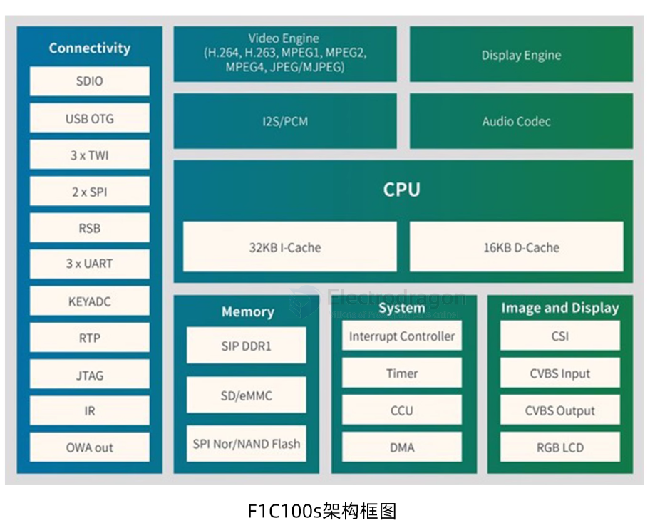

# F1C100-dat

- [[F1C100s_Datasheet_V1.0.pdf]]

## SCH 

- [[lichee_nano_8.16(Schematic).pdf]]

- [[C100-MP5-SCH.pdf]]

## Note 

- esp8089以modprobe方式挂载，直接通过串口替换原来固件
- 第二个固件esp8089需要手动modprobe一下

- [[ESP8089-dat]]

- Nano 需要插卡启动（或者焊接spi flash），只插上 USB基本是无反应，屏幕无输出状态，但可在不插卡无 flash 状态下通过 USB 启动 U-boot
- Nano 的系统调试串口是 UART0 ，即板子丝印上的的 “U0：Tx Rx” 标识的两个引脚

## SDK 

- [[Linux-dat]]、[[RT-Thread-dat]] (CN)、[[Xboot-dat]] (CN)

- [[uboot-dat]] - [[sunxi-tools-dat]]

- [[ubuntu-dat]]

- [[buildroot-dat]]

- [[lvgl-dat]] - [[openwrt-dat]] - [[wifi-dat]]

### image == Nano_pub_V*.zip

为了让大家上手即食，**Nano_pub_V*.zip** 是我们给出的解决方案。

Nano_pub_V4\image

- Nanoflash480272.bin
- Nanoflash800480.bin
- Nanoflash800480.bin.old
- Nanoflash800600.bin
- Nanotf480272.dd
- Nano tf8800480.dd
- Nano tf800600.dd
- test.bin

modules\tf\4.15.0-next-20180202-licheepi-nano+

- kernel
- build
- modules.alias
- modules.alias.bin
- modules.builtin
- modules.builtin.bin
- modules.dep
- modules.dep.bin
- modules.devname
- modules.order
- modules.softdep
- modules.symbols
- modules.symbols.bin

uboot\800600

- u-boot-spi-flash.bin
- u-boot-tf.bin

build

- configs
- mnt
- p1
- p2
- boot.cmd
- boot.scr
- clear_partion.sh
- env.sh
- fstab
- gen_scr.sh
- pack_flash_img.sh
- pack_tfimg.sh
- pull_br.sh
- pull_kernel.sh
- pulluboot.sh
- README.md
- update-scr.sh
- write_all.sh
- write boot.sh
- write_dd.sh
- write_mkfs.sh
- write_p1.sh
- write_p2.sh
- write_partion.sh
- write_spiflash.sh
- write_swap.sh

#### V4
> * 剪裁文件系统大小，优化开机速度.
> * 支持480*272,800*480,800*600的rgb显示屏.
> * 支持lichee官方wifi,esp8089．
> * 支持lichee官方触摸屏．
> * 支持lichee官方的RBG2VGA模块.

#### V3
> * 支持480*272,800*480,800*600的rgb显示屏.
> * 支持lichee官方wifi,esp8089．
> * 支持lichee官方触摸屏．
> * 支持lichee官方的RBG2VGA模块.

#### V2
> * 支持480*272,800*480的rgb显示屏.
> * 支持lichee官方触摸屏．

## Image Flashing 

### TF card == linux 

镜像包中的image文件夹下的dd文件，已包含了相应的Bootloader、Kernel、文件系统等等，只需简单两步即可完成烧录；

插上tf卡后，命令行执行 sudo fdisk -l 查看tf卡盘号；

执行 即可完成烧录 

    sudo dd if=/path/to/your-dd-image of=/your/tf-card && sync 

### TF card == WIN 

使用软件 win32disk 进行一键烧录，可到 [此处](http://www.onlinedown.net/soft/110173.html) 下载;

### Flash Empty 

在flash内容为空的情况下（fel模式下的一种情况）进行烧录时，通过micro-usb数据线将Nano与电脑连接，执行

    sudo sunxi-fel -p spiflash-write 0 Your-Flash-BIN

### Flash NOT Empty 

若flash中已有系统，可通过：

- 短接flash的 1、4 两脚，然后重新上电，上电后松开短接，即可重新进入fel模式，进行再次下载
- 在启动到内核前，回车进入 [[uboot-dat]]，执行 sf probe 0;sf erase 0 0x100000;reset即可重新进入fel模式

## ref 

- [[allwinner-dat]] - [[sipeed-dat]]

- https://pan.baidu.com/s/1smzuGS9#list/path=%2F