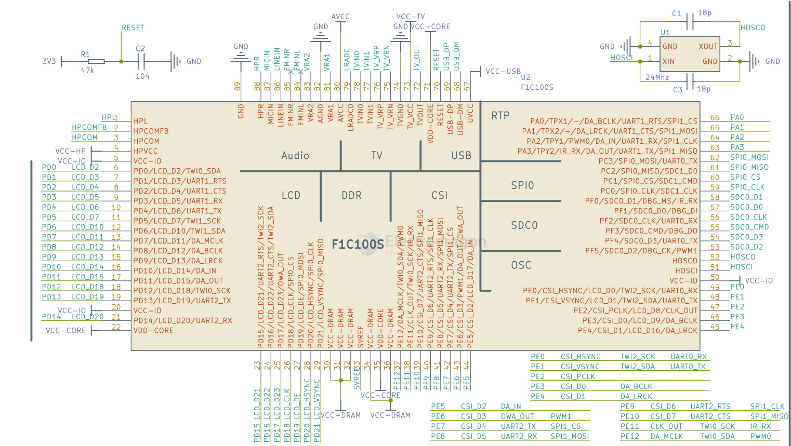
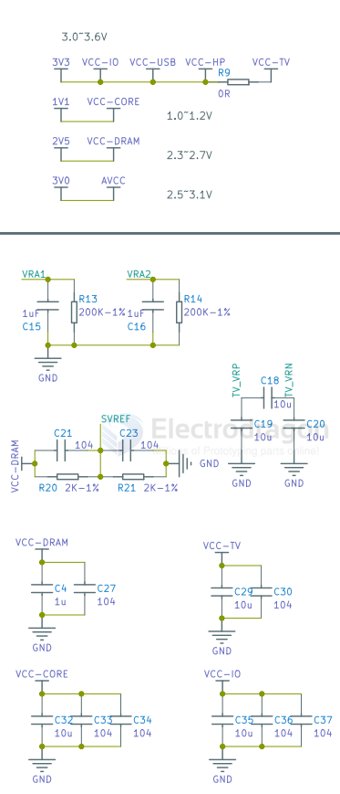
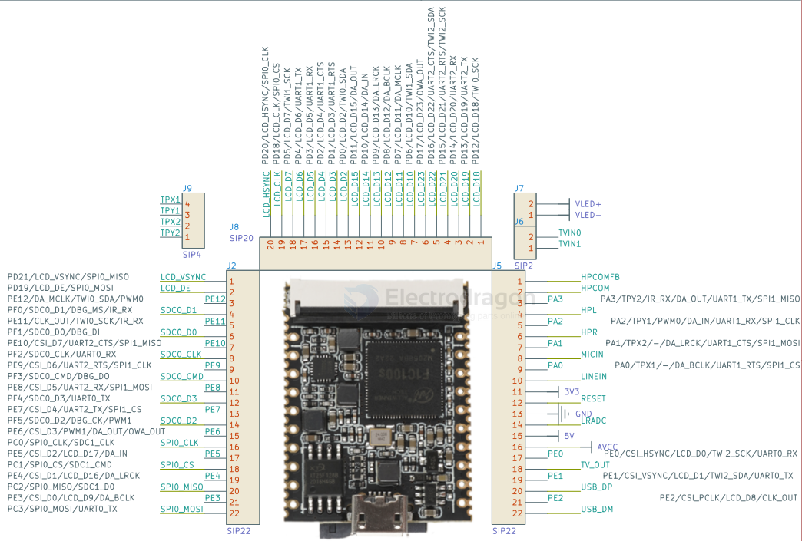

# F1C100-HDK-dat

- [[F1C100s_Datasheet_V1.0.pdf]]

- [[F1C100-SDK-dat]] - [[F1C100-HDK-dat]]

- [[EA3036-dat]] - [[USB-OTG-dat]]

- [[memory-dat]] - [[spi-flash-dat]] - [[sd-dat]]

## HDK 

- [[LCD-dat]] - [[touchpanel-dat]]

- [[VGA-dat]] - [[sensor-Camera-dat]]

## SCH 

- [[lichee_nano_8.16(Schematic).pdf]]

- [[C100-MP5-SCH.pdf]]

## peripherals 

- [[ESP8089-dat]] - [[espressif-dat]]

## core chip 

filters 

## lichee nano footprint 

## ref 

- [[F1C100-dat]]

- [[soldering-dat]]