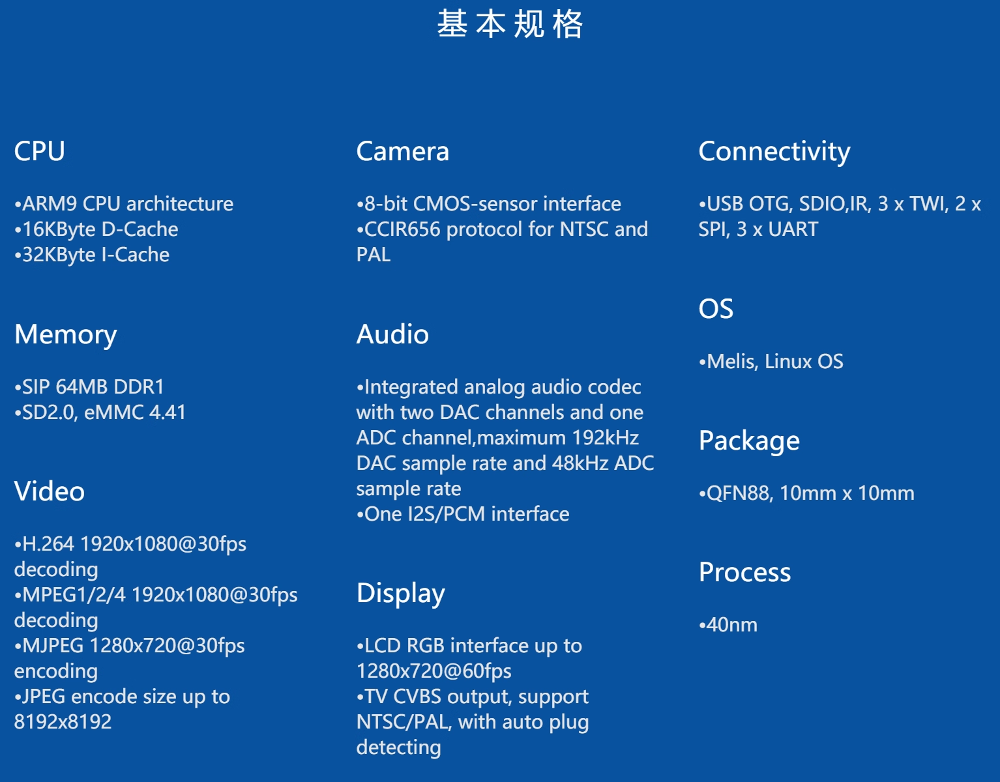
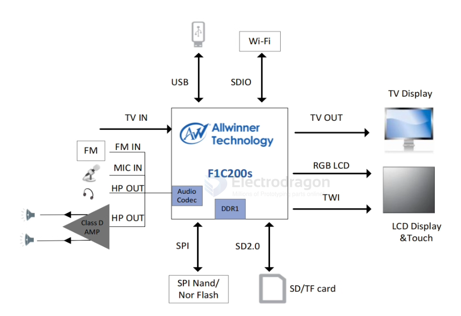
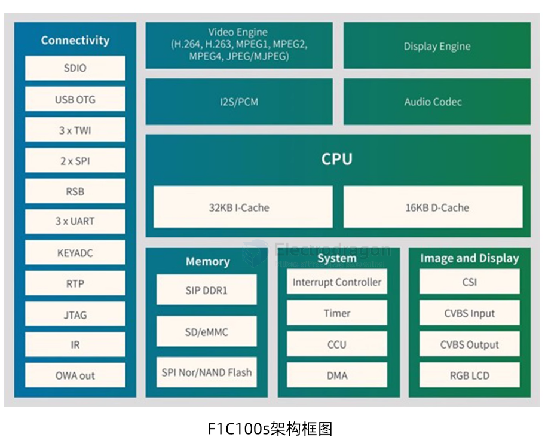

# F1C100-dat

## F1C200-dat 

全志 F1C200s 芯片是全志性价比极高的多媒体芯片之一，具有低成本、低功耗、开发简单、编解码性能强劲等特点，广泛应用于MP4、车载设备等带屏幕的智能硬件产品。

主要规格：
- ARM9 CPU
- SIP 64M DDR
- 支持H.264 1920x1080@30fps 解码
- 支持MJPEG 1280x720@30fps 编码
- 丰富的音视频接口

## function application diagram 

## chip info 

- [[F1C100-SDK-dat]] - [[F1C100-HDK-dat]]

## ref 

- [[allwinner-dat]] - [[sipeed-dat]]

- https://wiki.sipeed.com/soft/Lichee/zh/Nano-Doc-Backup/index.html

- [[V3S-dat]]

