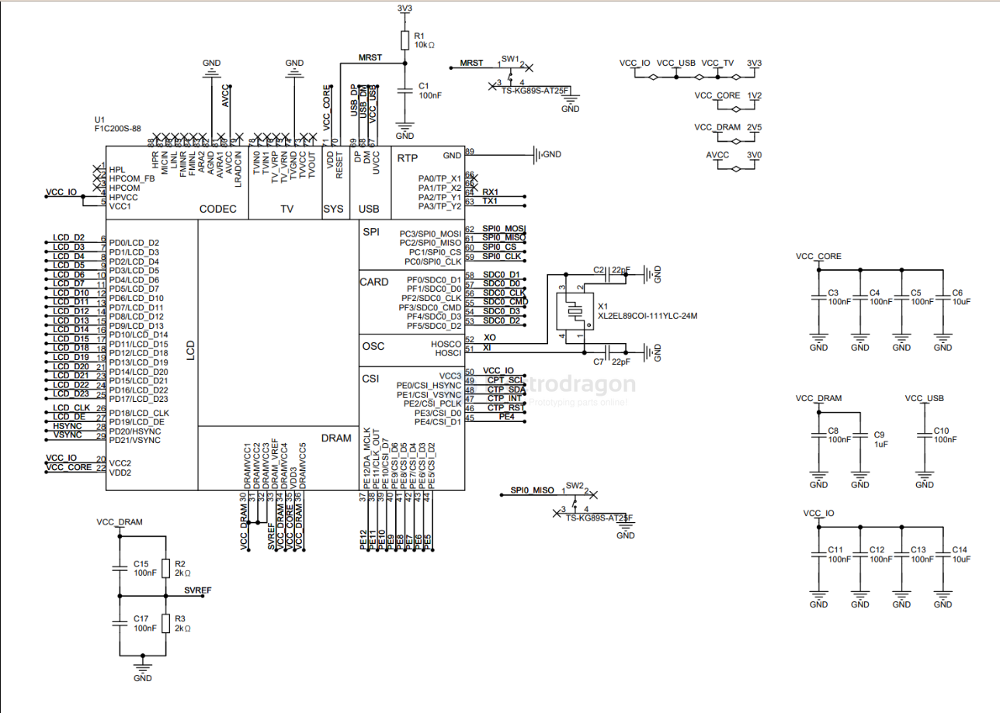
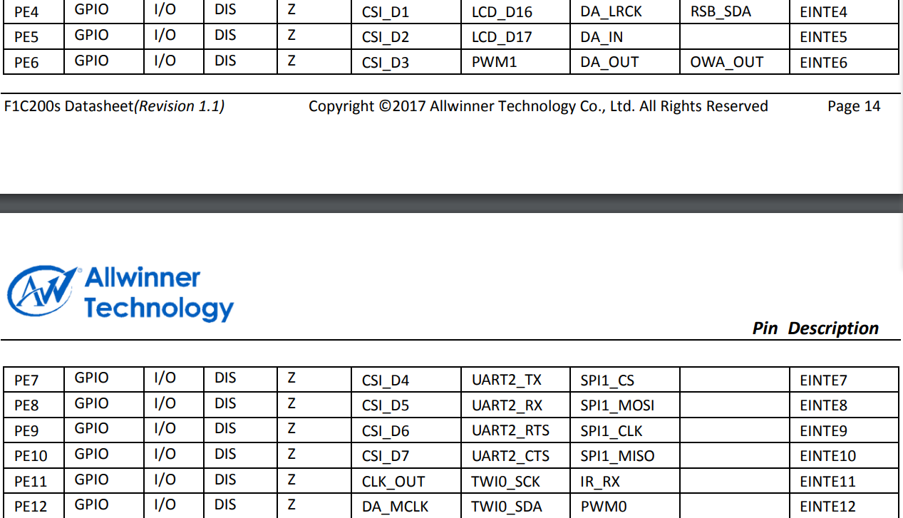

# F1C200-dat

- [[F1C100-dat]]

core 

其中SVREF用于给DRAM提供参考电压，该部分所需电压为VCC_DRAM/2。VCC_DRAM为DRAM供电，电压为2.5V，VCC_IO为GPIO供电，电压为3.3V，VCC_CORE为核心供电，电压为1.2V。AVCC为模拟供电，该部分非常重要，不接会导致USB Host无法枚举设备，同时需要注意该引脚供电范围为2.5V-3.1V，不可以使用3.3V供电，会导致内部电路损坏。X1为24M晶振，为芯片提供时钟信号，采用22pF负载电容。

- [[SDMMC-dat]] - [[memory-dat]]

- [[serial-dat]]

- [[LDO-dat]] - [[LDO-3CH-dat]] - [[LDO-dat]]

- [[USB-dat]] - [[USB-OTG-dat]]

- [[LED-driver-dat]] - [[parallel-display-dat]] - [[RGB-LCD-dat]]

- [[ubuntu-dat]] - [[uboot-dat]] - [[linux-dat]]

- [[video-decodec-dat]]

## external GPIOs 

2.7 外部IO接口
此处引出了未使用的IO，用户可连接其他设备，C35为滤波电容，用于保证电源质量，该部分引脚功能可以参考下图（来源：芯片数据手册14/15页）：

## ref 

- [[allwinner-dat]]

