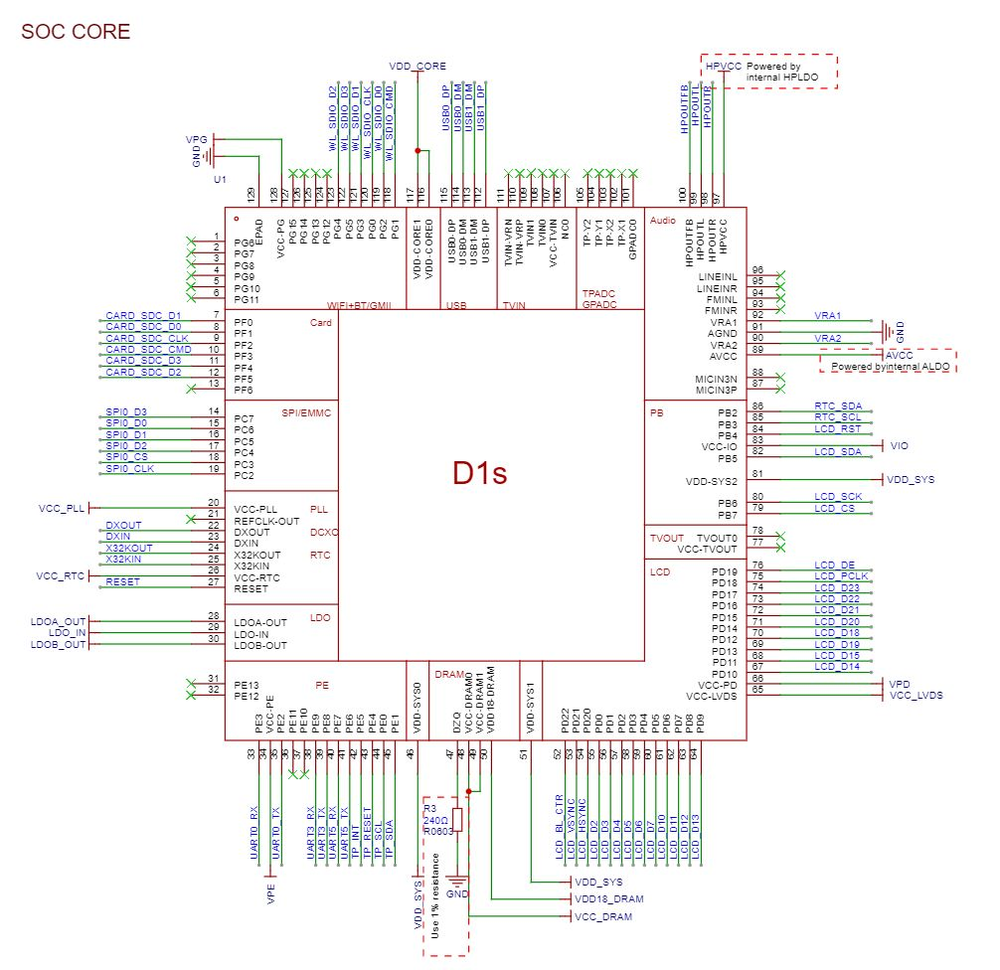

# T113-dat.md

- [[thermal-imaging-camera-dat]]

- [[D1S-dat]]

## chip version 

- T113-S3 

## SCH 

## Note 

务必先焊接除T113以外的元器件，烧录51单片机固件，按下面的说明，测量3.3V、1.5V、0.9V全部正常再焊T113，否则若EA3036的FB虚焊将会直接烧坏T113。

## ref 

- [[allwinner-dat]] - [[allwinner]]

- [[T113]]