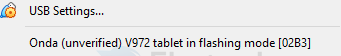
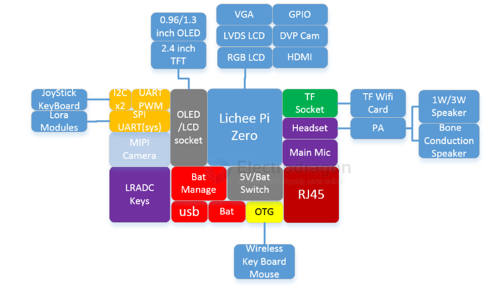

# V3S-dat

- [[Allwinner_V3s_User_Manual_V1.0.pdf]]

## test 

    vb@ubuntu14:~$ sudo sunxi-fel -l
    [sudo] password for vb: 
    USB device 002:003   Allwinner V3s     12c00000:04004620:51900700:440e0ccb

## virtualbox setup 

## suport 

- [[camera-dat]] == OV7670，OV2640等

- [[keyboard-dat]] == support wireless keyboard

## APP 

- [[laptop-dat]] == [[V3S-dat]] + [[battery-dat]] + [[keyboard-dat]] + [[LCD-dat]]

## HDK 

- [[lichee_zero_Schematic.pdf]] - [[lichee_zero_dock_Schematic.pdf]]

base-board 

- [[peripherals-dat]]

## SDK 

- [[CODEC-dat]]

## images 

- https://mega.nz/folder/A8g1Hb4J#WcuoqvbpasKlVB8-YEpWPA
- https://dl.sipeed.com/shareURL/LICHEE/Zero/Images

- [[memory-dat]]

- 2  wifi_audio_cam_zero.zip 70.08 MB 2020-04-18 08:27:27 
- 3  lpi_zero_cam.zip 48.06 MB 2020-04-18 08:15:44 
- 4  u-boot-sunxi-with-spl-vga.bin 399.80 KB 2019-04-28 14:08:26 
- 5  wifi_audio_cam_serial_zero.rar 53.91 MB 2019-04-24 16:38:06 
- 6  zero_cam.rar 9.53 MB 2019-01-03 00:09:27

## SYSTEM 

- [[raspbian-dat]] - [[debian-dat]]

## ref 

- [[allwinner-dat]]