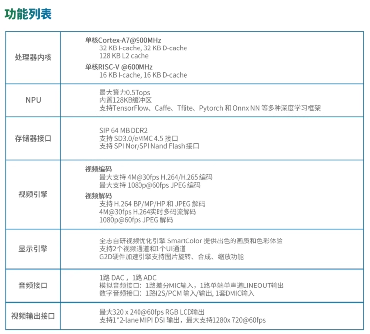

# V851-dat

V851s是全志研发的AI视觉人工智能芯片，集成了Arm A7@900MHz + RISC-V E907@600MHz + 0.5T NPU 三核异构架构，SIP 64M DDR，使用22nm制程，具有丰富的音视频接口，可以广泛应用于安防摄像头、家居摄像头、智能后视镜、扫描翻译笔、运动相机、考勤机、行车记录、楼宇门禁等产品形态。

- [[ARM-dat]]

## application 

## ref 

- [[allwinner-dat]]