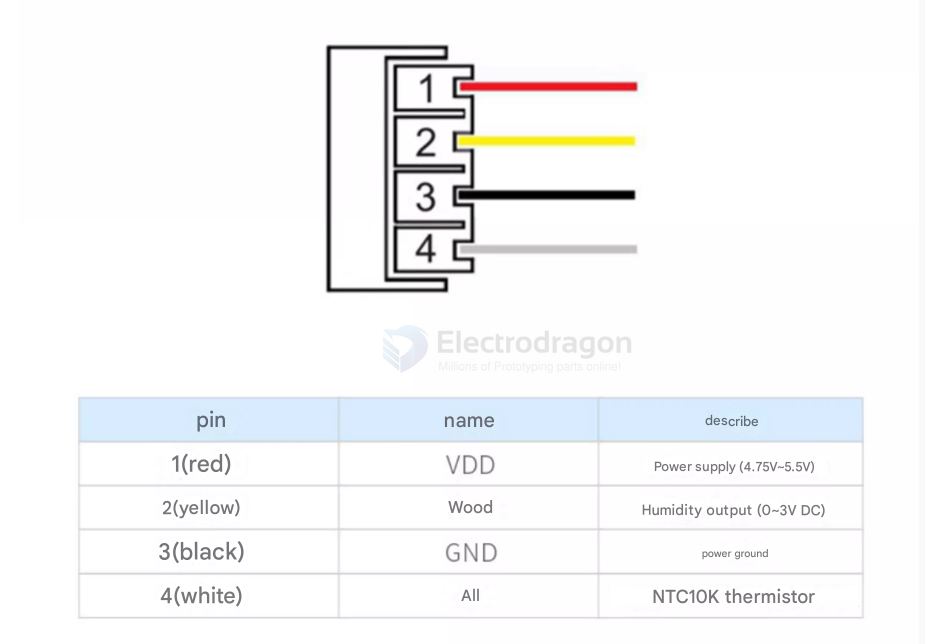

# AM1011-dat.md

## main specs 

- 温度：-40~+80°℃
- 湿度：0~99.9%RH
- 精度：±0.3C/±3%RH

## AM1011A — Upgraded Humidity & Temperature Sensor 

AM1011A is an upgraded sensor module that includes a dedicated ASIC, a high-performance silicon-based capacitive humidity sensor and an on-chip temperature sensor. It provides an analog voltage output (0–3 V). Compared with the previous generation, AM1011A offers improved stability in high-temperature/high-humidity environments, better accuracy, faster response, and a wider measurement range. Each unit is factory calibrated and tested for reliable mass deployment.

### Key specifications

| Item                   | Specification                                                               |
| ---------------------- | --------------------------------------------------------------------------- |
| Model                  | AM1011A                                                                     |
| Supply voltage         | DC 4.75–5.25 V                                                              |
| Output signal          | 0–3 V analog voltage; Temperature: 10 kΩ NTC output                         |
| Sensing elements       | Silicon-based capacitive humidity sensor + on-chip temperature sensor (NTC) |
| Temperature range      | -40 to +80 °C                                                               |
| Humidity range         | 0 to 99.9 %RH                                                               |
| Temperature accuracy   | Typical: ±0.3 °C (documentation also shows NTC tolerance ~±1%)              |
| Humidity accuracy      | ±3 %RH (typical)                                                            |
| Temperature resolution | 1 °C                                                                        |
| Humidity repeatability | ±1 %RH                                                                      |
| Humidity hysteresis    | ±1 %RH                                                                      |
| Long-term stability    | Humidity drift < ±0.5 %RH / year; Temperature drift < 0.1 °C / year         |
| Response time          | Temperature: ~6 s; Humidity: <8 s (to 63% step)                             |
| Housing material       | ABS + PC plastic                                                            |
| Power consumption      | ~1.5 mA                                                                     |
| Weight                 | ~9.2 g                                                                      |

Notes:
- Some sources show slightly different temperature accuracy (NTC tolerance). Consult the official datasheet for final tolerances.
- AM1011A provides analog outputs; if you need digital interfaces, consider AMT1001 / AM232x family modules.

## ref 

- [[aosong-dat]]
