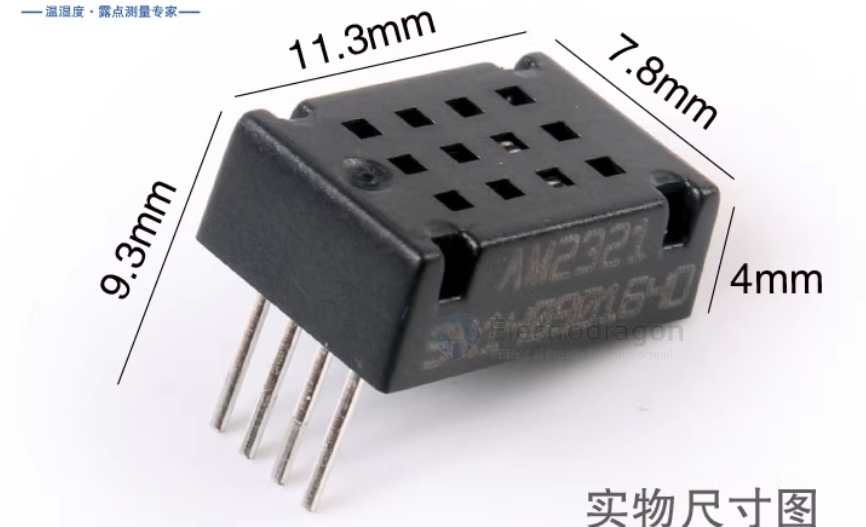
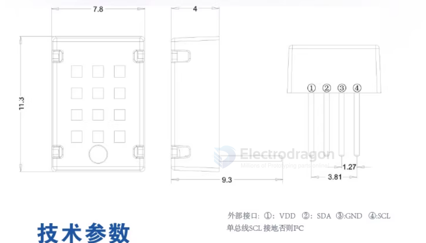
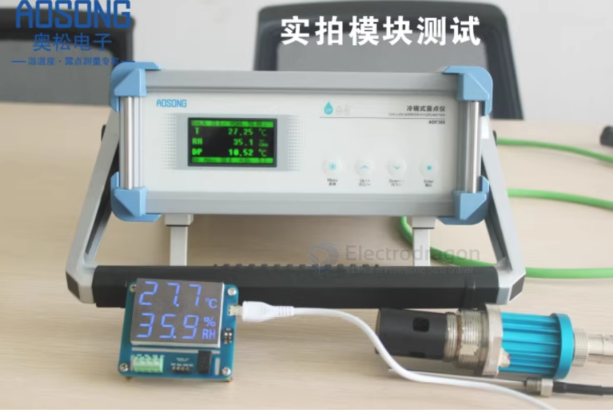

# AM2322-dat

- [[STH1020-dat]]

AM2322 Digital Temperature and Humidity Sensor

- High Cost-Performance Ratio
- Ultra-Low Voltage Operation
- Standard I2C and Single-Bus Output
- Excellent Long-Term Stability

The AM2322 digital temperature and humidity sensor is a compound sensor that provides calibrated digital signal output for temperature and humidity. It adopts specialized temperature and humidity acquisition technology, ensuring extremely high reliability and excellent long-term stability. The sensor includes a capacitive humidity sensing element and a high-precision integrated temperature measuring element, connected to a high-performance microprocessor. This product features excellent quality, ultra-fast response, strong anti-interference capability, and extremely high cost-performance ratio. The AM2322 communication method uses both single bus and standard I2C protocols. The standard single-bus interface makes system integration simple and quick. With its ultra-small size, extremely low power consumption, and signal transmission distance of up to 20 meters or more, it becomes the best choice for various applications, even in the most demanding scenarios. The I2C communication method adopts standard communication timing, allowing users to connect directly to the I2C communication bus without additional wiring, making it simple to use. Both communication methods directly output digitally processed humidity, temperature, and CRC verification information with temperature compensation, eliminating the need for secondary calculations or temperature compensation of humidity readings, providing accurate temperature and humidity information. The two communication methods can be freely switched, giving users flexible choices and convenient use across a wide range of applications. The product features 4 leads for easy connection, and special packaging forms can be provided according to user requirements.

## Application Areas
HVAC, dehumidifiers, testing and inspection equipment, consumer products, automotive, automatic control, data loggers, weather stations, home appliances, humidity regulation, medical, and other related humidity detection and control applications.

## Product Highlights
Fully interchangeable, low cost, long-term stability, relative humidity and temperature measurement, ultra-long signal transmission distance, digital signal output, precise calibration, extremely low power consumption, standard single-bus digital interface, standard I2C bus digital interface, freely selectable communication methods.

## Measurement Range
Temperature: -40~+80°C
Humidity: 0~99.9%RH

## Accuracy (at 25°C):
Temperature: ±0.5°C
Humidity: ±3%RH (10~90%RH)

## Resolution:
Temperature: 0.1°C
Humidity: 0.1%RH

## Attenuation Value:
Temperature: <0.1°C/year
Humidity: <1%RH/year

## Sensor Type
Temperature: Resistive sensor
Humidity: Capacitive sensor

## Response Time:
Temperature: 5s
Humidity: 5s 1/e(63%)

## Operating Temperature Range:
-40~+80°C

## Power Supply:
DC: 3.1~5.5V

## Output Signal:
Single-bus/I2C signal

## Housing Material:
PC plastic

## Weight:
0.5g

## ref 

- [[AM2322]] - [[aosong]]