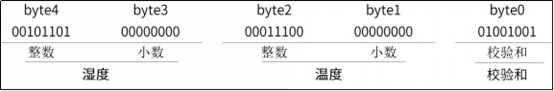
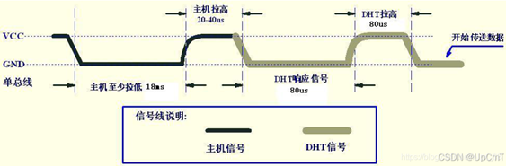
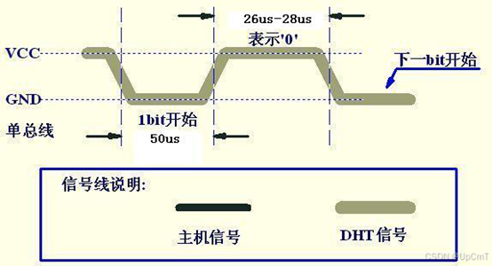
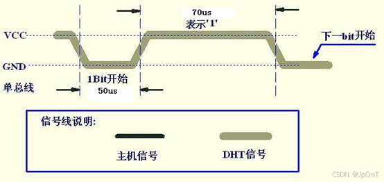
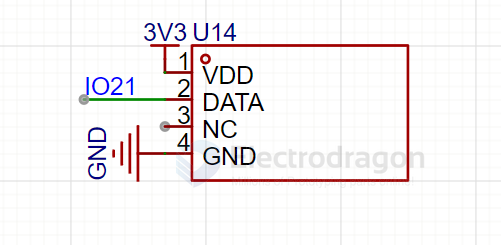

# DHT11-dat

- [[STH1046-dat]]

## DHT11 Output Data Format

The DHT11 sensor outputs data in the following format:

**Data Structure:** `8-bit humidity integer + 8-bit humidity decimal + 8-bit temperature integer + 8-bit temperature decimal + 8-bit checksum`

### Data Breakdown:
- **Byte 1:** Humidity integer part (8 bits)
- **Byte 2:** Humidity decimal part (8 bits) 
- **Byte 3:** Temperature integer part (8 bits)
- **Byte 4:** Temperature decimal part (8 bits)
- **Byte 5:** Checksum (8 bits)

由以上数据就可得到湿度和温度的值，计算方法：
湿度 = byte4 . byte3 = 45.0(%RH)
温度 = byte2 . byte1 = 28.0(℃)
校验（byte5） =？ byte4 + byte3 + byte2 + byte1 = 73 (= 湿度 + 温度) （如果相等则校验正确）
时序简介：主机（ESP32）向DHT11发送传输数据命令（拉低再拉高）->DHT11响应收到命令（拉低再拉高引脚）->DHT11向主机（ESP32）传输数据（拉低再拉高）

命令发送和响应

数据0：

数据1：

说明：上图中的特定值，其实是按要求时间段取的一个中间值，具体范围大家可以查询手册。

时序总结：无论是主机向DHT11发送还是DHT11向主机发送，都是拉低再拉高引脚完成一个动作，包括命令、应答、发送1bit数据，不同的是拉低的时间和拉高的时间

## SCH 

ESP32 - IO21 

## ref 

- [[STH1046-dat]]