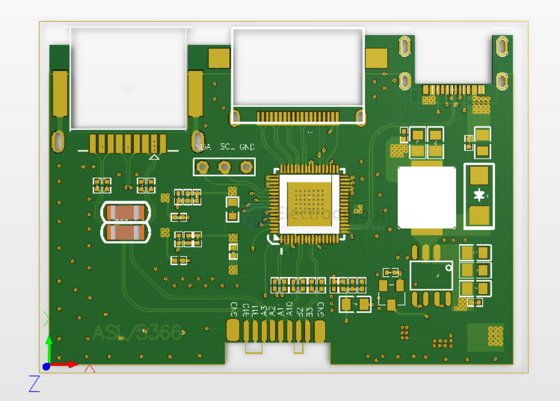
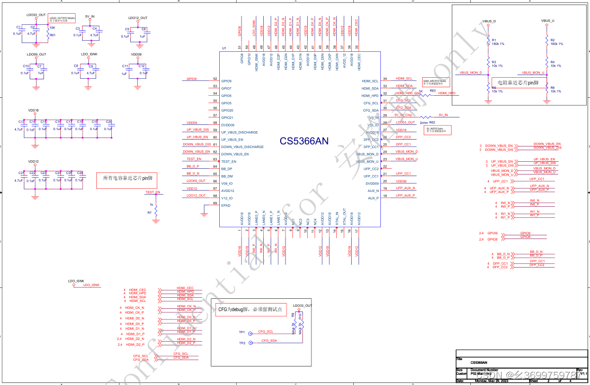

# asl-tek-dat

## CS5366 

ASL集睿致远新推出的CS5366是一款Type-C转HDMI4K的视频转换芯片

通过USBType-C连接器将DPRX视频信号转换为HDMI/DVI TX视频信号。DP信号转接只用2lane，另外2lane可以输出USB3.0/3.1信号，同时兼容PD3.0，并支持双向PD,相较于CS5266刷新率从30HZ上提升到60HZ，采样频率最高可达192KHz并能按客户需求配置成不同的功能组合，是目前功耗很小的一颗芯片。相比AG9411，GSV2201，RTD2172兼容性更稳定

功能特征
- 支持最大分辨率/定时高达4k@60Hz
- 支持DSCv1.2a，并向后兼容前一版本
- 支持DSC解码器和直通模式
- 嵌入式32位RISC-V处理器和SPI Q 闪存
- 嵌入式EDID (如果终端设备没有CS536x，它将响应EDID)
- 支持HDCP1.4和HDCP2.3，支持HDCP中继器
- 支持RGB4:4:4 8/12位bpc和YCbCr 4:4:4,4:2:2、4:2:08/10/12位bpc
- 支持多达32个频道的16/20/24位音频高达192kHz采样频率
- 支持USB在线进行固件Q更新

应用
笔记本电脑、主板、显示器、电视、投影仪、标牌、流盒、游戏机、AR、VR系统等。

CS5366设计typec转HDMI_2lane 4k_60方案

CS5366设计typec转HDMl2lane4k_60方案原理图

CS5366芯片是ASL集睿致远新推出的2Len带PD的扩展坞方案芯片，CS5366可达4K60HZ，可以替代GSV2201，替代AG9411，功能替代VMM7100，VMR7100，VM6100等等。

## ref 

