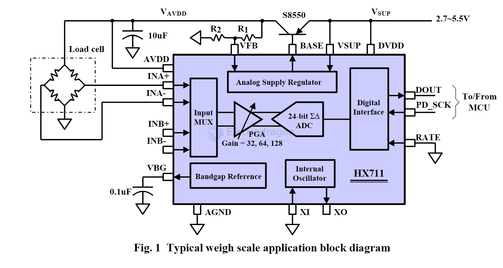

# HX711-dat

- [[ADC-dat]]

- datasheet = [[hx711_english.pdf]]

FEATURES
- • Two selectable differential input channels
- • On-chip active low noise PGA with selectable gain of 32, 64 and 128
- • On-chip power supply regulator for load-cell and ADC analog power supply
- • On-chip oscillator requiring no external component with optional external crystal
- • On-chip power-on-reset
- • Simple digital control and serial interface: pin-driven controls, no programming needed
- • Selectable 10SPS or 80SPS output data rate
- • Simultaneous 50 and 60Hz supply rejection
- • Current consumption including on-chip analog power supply regulator:  normal operation < 1.5mA, power down < 1uA
- • Operation supply voltage range: 2.6 ~ 5.5V
- • Operation temperature range: -40 ~ +85℃
- • 16 pin SOP-16 package 

24-Bit Analog-to-Digital Converter (ADC) for Weigh Scales

## APPs 

