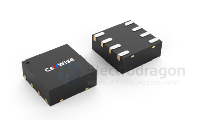
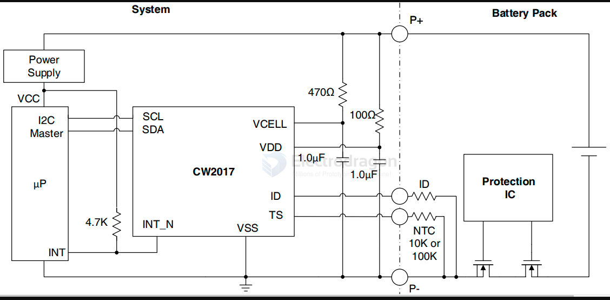

# CW2017-dat.md

- [[CW2017-dat]] - [[cellwise-dat]]

- [[insta360-go2-dat]] - [[insta360-dat]]

- [[voltmeter-dat]] - [[sensor-voltage-dat]] - [[sensor-power-dat]]

CW2017BAAD

单节或双节锂电池电量计芯片支持外部温度检测

CW2017BAAD是一款小尺寸，无需检流电阻的锂电池电量计量芯片。芯片持续监测电池在充电/放电状态下的电压，运行专利“FastCali”电量计算法，结合电池建模信息，可准确计算电池剩余电量。

CW2017BAAD适用于包括锂锰，锂钴和聚合物等多种类型的锂电池应用。

http://www.cellwise-semi.com/products/product/voltameter/5

