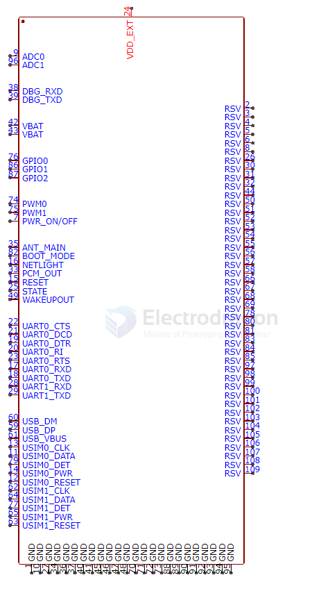
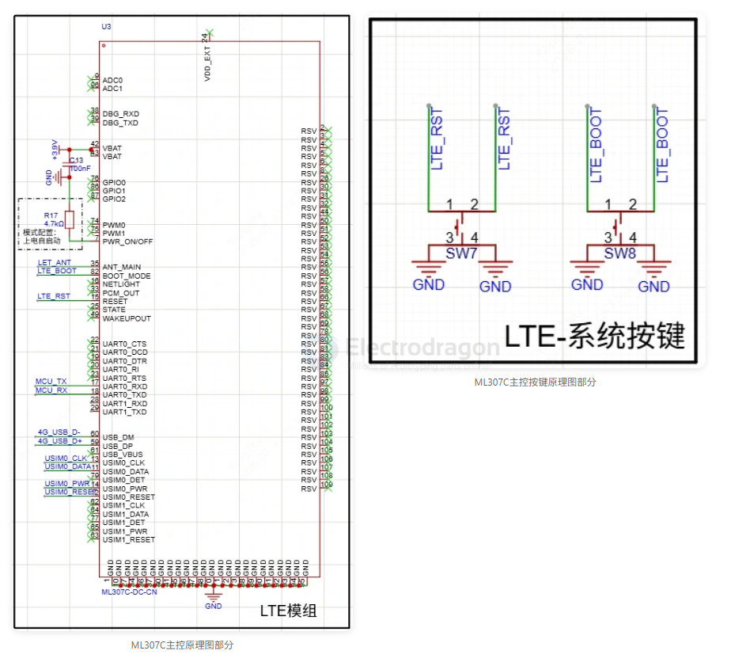
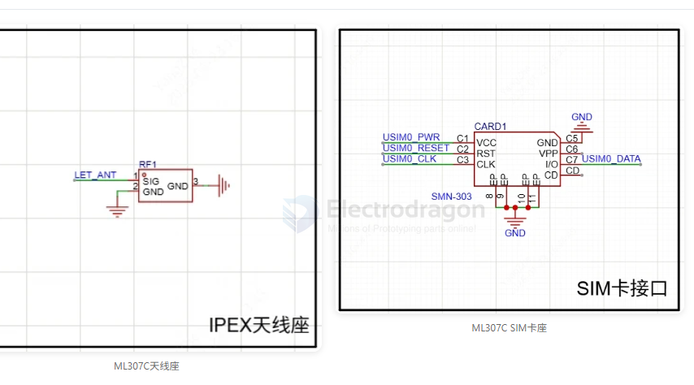

# ML307C-dat

- [[chinamobile-dat]] - [[ML307C-dat]] - [[M2M-dat]] - [[LTE-dat]]

## info 

LTE模组选用ML307C，此模组功能很多，除了LTE功能外，也可做IO扩展功能，带有ADC,PWM等功能，模组PWR部分已配置4.7K上拉实现开机自启动，USIM的IO连接SIM卡座，USIM1还可接个ESIM来切卡，但本项目考虑布局和焊接问题所以去除。考虑到ML307C封装的焊接问题，非必要焊盘均以替换成丝印，方便走线同时也能避免新手焊接造成底部连锡，仅需焊接最外围邮票孔即可。

## ref 

