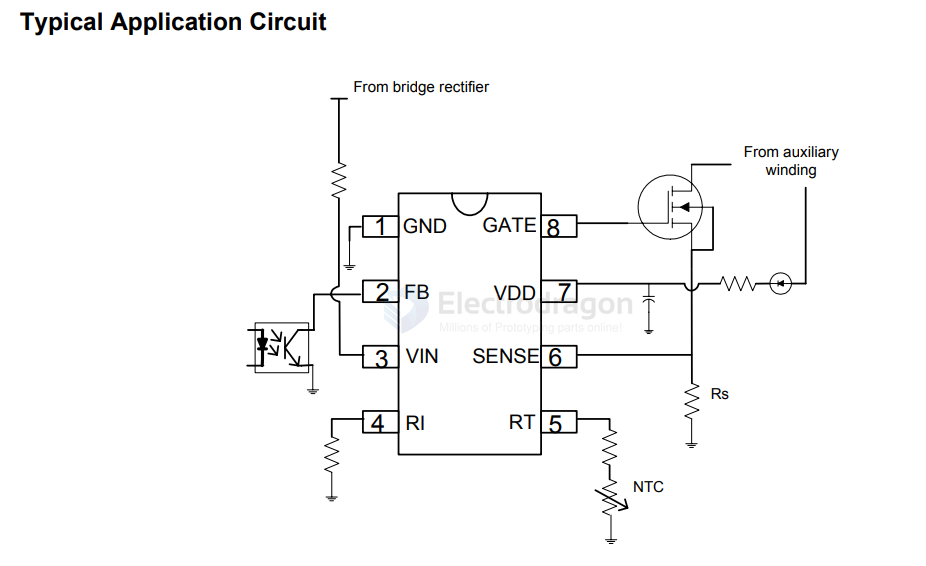
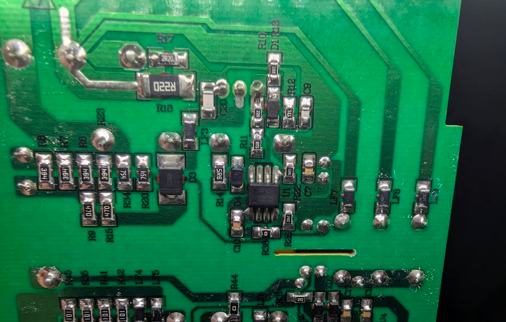
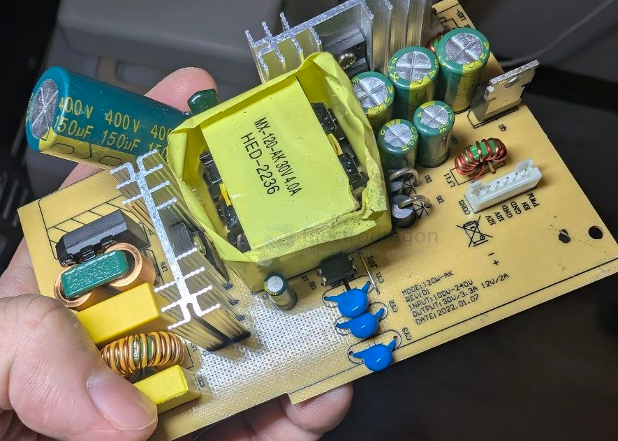
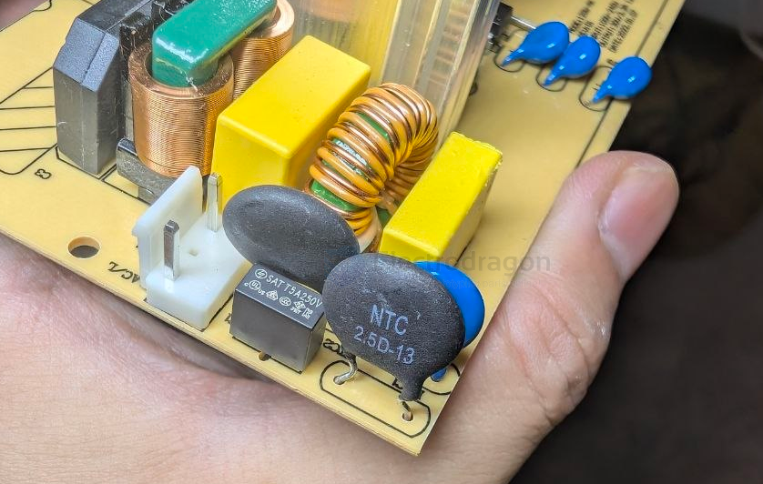
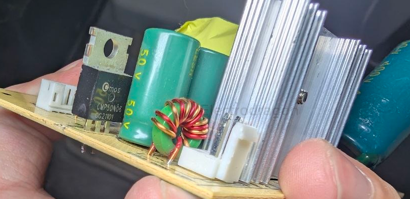
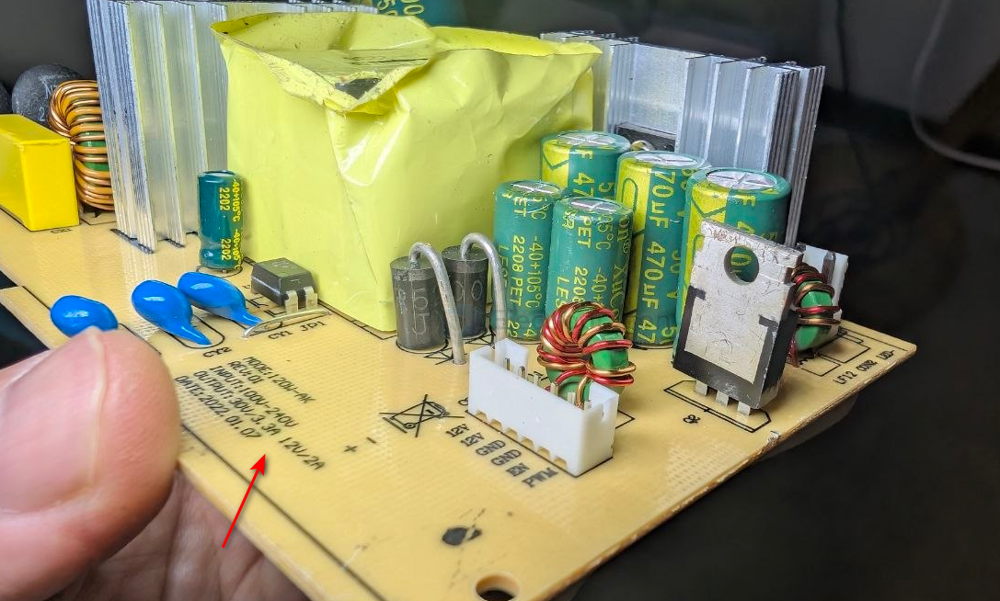

# CR6842-dat.md

- [[CR6842-dat]] - [[Center-Tapped-Full-Wave-rectifier-dat]]

- [[CR6842-dat]] - [[chip-rail-dat]] - [[AC-mains-dat]] - [[ACDC-dat]]

## CR6842S 

- [[cr6842s-datasheet.pdf]]

Green-Power PWM Controller with Freq. Jittering 

## build 

main chip CR6842 - plus - [[LM358-dat]]

large [[capacitor-dat]] 400V 150UF 

- [[transformer-dat]] == MX-120-AK 30V4.0A HED-2236

- [[optical-coupler-dat]] - [[PC817-dat]]

- [[NTC-dat]] 2.5D-13 - [[varistor-dat]] - 10D471

- [[fuse-dat]] - T5A 250V

- [[capacitor-safety-dat]] on the top-right == D222MY1 - [[CR6842-dat]]

- [[mosfet-dat]] - CMP50N06

- [[diode-dat]] == SR5200 

- [[bridge-rectifier-dat]] - KBL610 - [[CR6842-dat]]

- [[capacitor-X-Y-dat]] - [[capacitor-dat]] - [[CR6842-dat]]

- [[choke-dat]] 

SR5200 ×2 并联
• 封装: DO-201AD
• 说明: 5A 200V 肖特基，小封装无散热片

MBR20200FCT
• 封装: TO-220F (全绝缘)
• 说明: 双肖特基共阴极 20A，带大散热片

绿磁环电感
• 封装: 环形
• 说明: 输出滤波电感

共模扼流圈
• 封装: 立式

                   
变压器副边

                     ┌────────────────┐
        S1 ─────────→│ SR5200 ×2 并联 │───┐
                     │  (5A×2=10A)   │   │
                     └────────────────┘   │
                                          ├──→ 功率电感 ──→ +DC
    中心抽头 CT ────────────────────────────┤         │
       ↓                                  │         ↓
     GND/Return                           │      输出电容
                                          │
                     ┌────────────────┐   │
        S2 ─────────→│ MBR20200FCT   │───┘
                     │ (dual diode    │
                     │  共阴极, 20A)   │
                     └────────────────┘

**上臂整流**
• 元件: SR5200 ×2 并联
• 说明: 变压器 S1 → 电感，负责半个周期

**下臂整流**
• 元件: MBR20200FCT
• 说明: 变压器 S2 → 电感，负责另半个周期，带大散热片是合理的 — 200V/20A 的 TO-220 需要散热

**两者都是整流管**
• 元件: —
• 说明: 在中心抽头正激拓扑中，没有独立的"续流管"

---

为什么 MBR20200FCT 不需要续流

在 连续导通模式 (CCM) 下，正激变换器的电感电流永远有一个通路：
- S1 正半周 → SR5200 导通，给电感充电
- S2 负半周 → MBR20200FCT 导通，给电感充电
- 两个管子轮流导通，电感电流始终连续

只有在 非连续模式 (DCM) 或单端正激中才需要独立的续流二极管。

## two types of dioes 

用两种不同的二极管而不统一，核心原因只有一个：成本和性能的平衡设计，具体拆解如下：

---

1. 电流能力不对称

在中心抽头整流中，两个绕组的电流波形不完全对称：

S1 → SR5200 ×2
• 峰值电流: 较低
• 平均电流: 较小
• 导通时间: 依占空比而定

S2 → MBR20200FCT
• 峰值电流: 较高
• 平均电流: 较大
• 导通时间: 同等

实际上 S1 和 S2 的电流应力是相同的（对称拓扑），那为什么还要不同？

---

2. 真正的原因：封装热阻

SR5200 ×2
• 封装: DO-201AD
• 热阻 (RθJA): ~50-60 °C/W
• 能否加散热器: ❌ 不能加散热片

MBR20200FCT
• 封装: TO-220F
• 热阻 (RθJA): ~25 °C/W (无散热器) → ~3-5 °C/W (带散热器)
• 能否加散热器: ✅ 可加

实际工程思路：

S1 臂需要承受 10A 整流能力，但 DO-201AD 封装单个最大就 5A。
- 方案 A：用 TO-220 大管子，+$0.3，但要多占空间
- 方案 B：两个 SR5200 并联，正好凑 10A，每个分担 5A 发热刚好不用散热片，成本最低

S2 臂同理，但设计者直接选了个 20A TO-220 封装，余量大、散热片一加轻松搞定，省去并联两个小管子的额外焊点。

---

3. 为什么不统一成一种？

**全部用 SR5200 ×4**
• 分析: 占板面积大，4 个 DO-201AD 分立焊点多，一致性差

**全部用 MBR20200FCT ×1**
• 分析: 一颗 MBR20200FCT 内部是两个共阴极二极管，但共阴极结构不适合中心抽头整流（需要两个独立二极管各接一个绕组）

**全部用两个独立的 TO-220 肖特基**
• 分析: 最干净方案，但成本 +$0.6，体积大一圈

所以最后的设计是：
 小管（SR5200×2 无散热）= 便宜够用，大管（MBR20200FCT 加散热）= 留余量，整体成本最优。

---

结论

这不是设计缺陷，是工程权衡下的最优解：

 ✅ 用两个 SR5200 并联代替一个大 TO-220 管，同时保留 MBR20200FCT 大管子加强另一臂，总成本和热管理都恰到好处。

如果你这块板实际工作是正常但其中一个 SR5200 会比较烫，那就是并联均流不完全的理想 — 但肖特基正温度系数会自己平衡，不用担心。

## ref 

