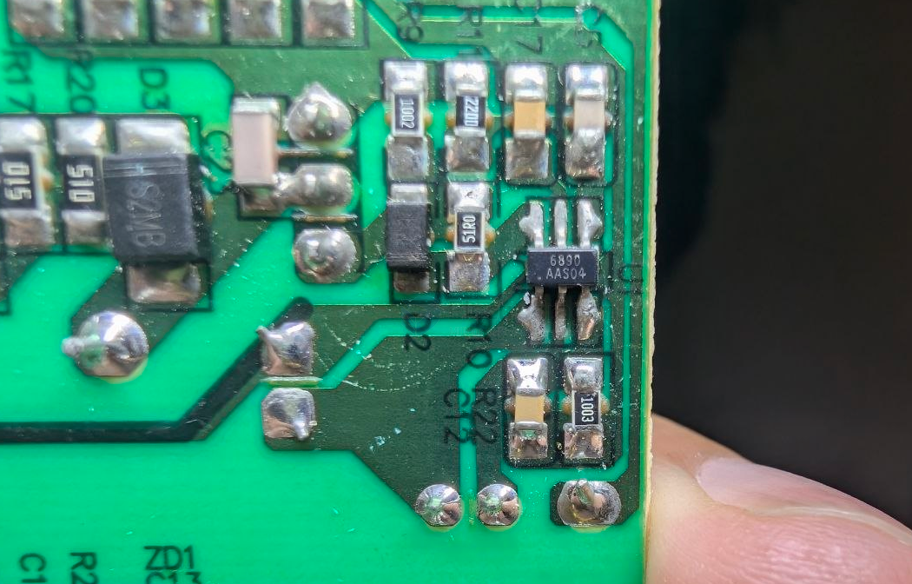
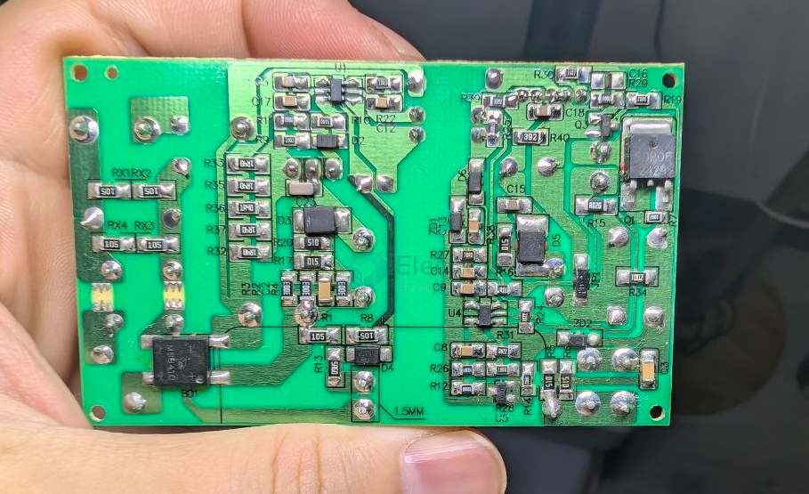

# chip-rail-dat

- [[CR6842-dat]] - [[chip-rail-dat]] - [[AC-mains-dat]]

- [[OPM1114-dat]] 

- [[CR6842-dat]] - [[chip-rail-dat]]

## CR6890 

The CR6890A (silk-marked as 6890) in a SOT23-6 package is a high-integration, low-standby power AC-DC green-energy PWM controller chip made by Chip-Rail.

build 

## ref 

