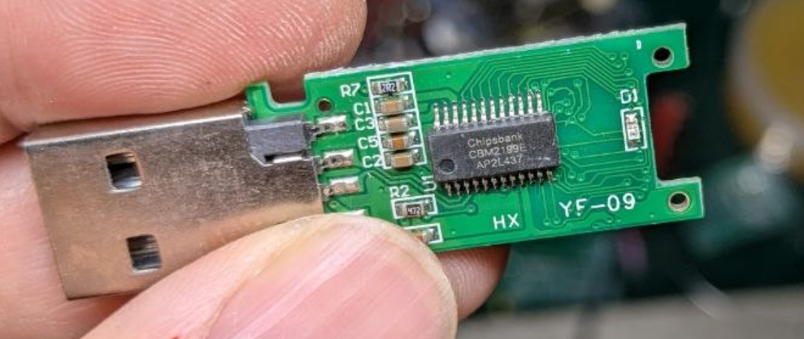

# CBM2199-dat

- [[chipsbank-dat]] - [[CBM2199-dat]]

https://www.usbdev.ru/files/chipsbank/cbm2199umptool/

https://www.usbdev.ru/files/chipsbank/cbm2099umptool/

- datasheet == [[CBM2090CBM2090L_1107.pdf]]

The CBM2090 is the USB 2.0 Flash Disk controller with the fastest transfer speed on the market.

CBM2090 can reach theoretical flash access speed limit of over 30MByte/s for read and 25MByte/s for write. For CBM1190, it can reach 1.0Mbytes/s write and 1.1Mbytes/s read.

## CBM2199E Overview

CBM2199E is a USB 2.0 controller launched by Chipsbank Technologies Co., Ltd. This chip is primarily used for high-capacity USB storage drives. It adopts the BCH ECC error correction algorithm, supporting up to 72-bit/1K. It offers advantages in bad block identification and data error correction capabilities, and features excellent wear-leveling algorithms.

| Feature | Specification |
| :--- | :--- |
| **Data Interface** | Wireless 802.11n (2.4/5G) & Wired 1000M |
| **Data Transfer Time** | Wireless ≤ 7s, Wired ≤ 5s |
| **Acquisition Matrix & Rate** | 1. 3072 x 3072 pixs: Continuous 3 fps 2. 1536 x 1536 pixs: Pulse 6 fps, Continuous 6/15 fps 3. 1024 x 1024 pixs: Pulse 12 fps, Continuous 12/15/25 fps 4. 768 x 768 pixs: Continuous 30 fps |
| **Spatial Resolution** | 3.5 lp/mm |
| **Storage** | 100 images |
| **MTF** | 82% @ 0.5 lp/mm / 78% @ 0.5 lp/mm |
| **DQE** | 60% @ 0.5 lp/mm / 55% @ 0.5 lp/mm |
| **Functions** | Soft Trigger / AED |

## Physical & Power

- **Structural Parameters**: 4.9 kg / Load capacity 135 kg / 460 × 460 × 15.5 (mm)
- **Battery**: 6000 mAh / 44.4 Wh / 8.4 V
- **Battery Management**: 15s quick battery swap, charging time ≤ 3H

## Environmental Requirements

- **Operating Environment**:
  - Temperature: 5°C to 35°C
  - Humidity: 30% to 80% RH (no condensation)
- **Storage Environment**:
  - Temperature: -10°C to 55°C
  - Humidity: 15% to 90% RH (no condensation)

