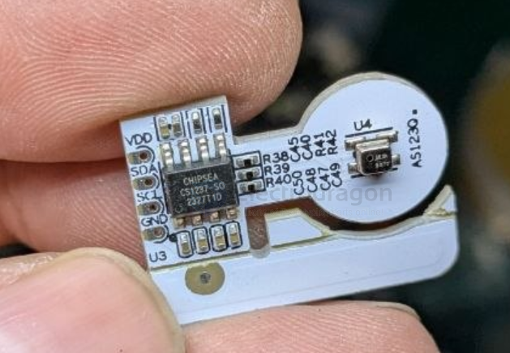

# CS1237-dat

- [[CS1237-dat]] - [[ADC-dat]] - [[chipsea-dat]]

- CS1237 是一款高精度、低功耗模数转换芯片，一路差分输入通道，内置温度传感器和高精度振荡器。
- CS1237 的 PGA 可选：1、2、64、128，默认为 128。
- CS1237 正常模式下的 ADC 数据输出速率可选：10Hz、40Hz、640Hz、1.28kHz，默认为 10Hz；
- MCU 可以通过 2 线的 SPI 接口 SCLK、 DRDY / DOUT与 CS1237 进行通信，对其进行配置，例如通道选择、PGA 选择、输出速率选择等。

## ref 

