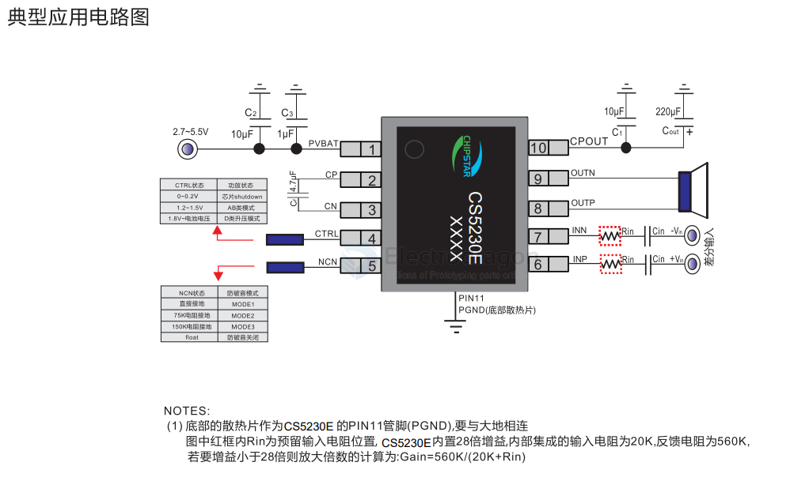
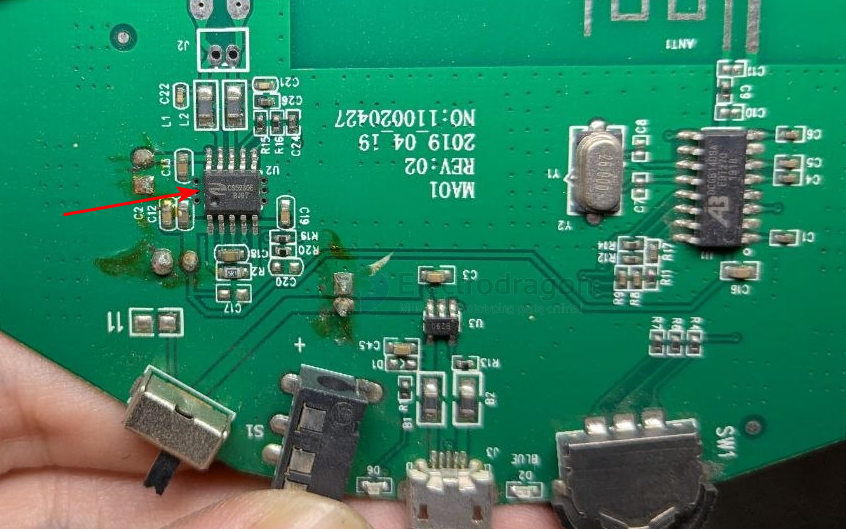

# CS5230-dat.md

- [[CS5230-dat]] - [[chipstar-dat]] - [[jieli-dat]]

5.3W Mono Class GF Audio Power Amplifier with Built-in Charge Pump, Fixed 28dB Gain, Class AB/D Switching, and Three Anti-Clipping Modes.

## Overview

CS5230E is a CMOS, capacitive boost-type Class GF mono audio power amplifier that delivers up to 5.3W of continuous power into a 4Ω load. The fixed 28dB internal gain reduces external component count. It integrates Class D and Class AB operating modes, providing high power output in Class D while allowing for interference-free operation in Class AB for systems with FM radio. The unique Non-Clipping (NCN) function automatically adjusts gain based on signal levels for a more comfortable listening experience.

Requiring only low-cost external passive components, CS5230E is an ideal audio subsystem solution for battery-powered mobile devices. Its fully differential architecture and high PSRR provide excellent RF noise immunity. Built-in overcurrent and overtemperature protection ensure reliability under abnormal conditions.

CS5230E is available in an ESOP10 package with an operating temperature range of -40°C to 85°C.

## Features

- **Integrated Boost**: Built-in Charge Pump module.
- **Operating Modes**: Selectable Class AB or Class D GF audio amplification.
- **Output Power**:
  - VBAT = 5.0V, RL = 4Ω:
    - 5.3W (THD+N = 10%, NCN OFF, Class D)
    - 4.3W (THD+N = 1%, NCN OFF, Class D)
  - VBAT = 3.4V, RL = 4Ω + 33μH:
    - 3.4W (THD+N = 10%, NCN OFF, Class D)
    - 3.0W (THD+N = 1%, NCN OFF, Class D)
- **Voltage Range**: 2.7V ~ 5.5V.
- **Power Consumption**: 
  - Shutdown Current: < 1μA.
  - Standby Current: 20mA @ 5V.
- **Technical Specs**:
  - Class D Modulation Frequency: 350kHz.
  - AERC Patent Technology: Excellent full-bandwidth EMI suppression.
  - High PSRR: -80dB @ 217Hz.
  - Noise Suppression: Superior pop-noise reduction.
- **Protection**:
  - Overtemperature protection.
  - Overvoltage protection.
  - Overcurrent protection.

## Applications

- Bluetooth Speakers
- Portable Audio Equipment

## SCH 

## board 

