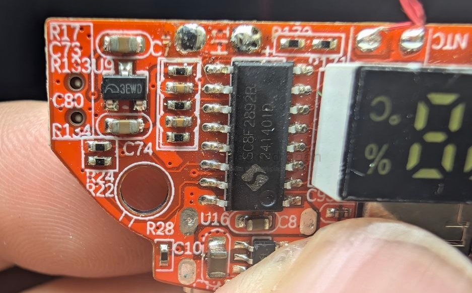
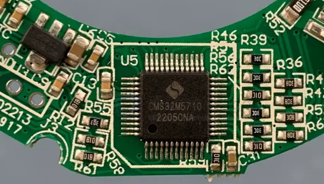

# cmsemicon-dat

## flash 

- [[memory-dat]] - SC8F289X - Cmsemicon touch enhanced flash memory 8-bit CMOS chip. - [[Cmsemicon-dat]]

SC8F2892 is a CmsemiconFLASH chip, Flash 4Kx14Bit, RAM256B, built-in RC oscillator 8MHz/16MHz, working voltage 2.5V-5.5V, GPIO up to 14, built-in touch button function, built-in WDT, LVD, high-precision 12-bit ADC, 2 operational amplifiers , provide 5-channel PWM.

- [[IP5306-dat]] - [[LDO-dat]] - [[microne-dat]]

- [[display-segment-dat]]

## MCU 

- [[CMS32M5710-dat]] - [[cmsemicon-dat]] - [[ARM-dat]]

https://www.keil.arm.com/devices/cmsemicon-cms32m5710/features/

- [[CMS32F033-dat]] - [[MCU-dat]] - [[GVM-dat]] - [[cmsemicon-dat]]

CMS32F033 == datasheet == [[CMS32F033-datasheet.pdf]]

32KB Flash, 8KB SRAM, operational amplifier, comparator, programmable gain amplifier. Widely used in application fields such as electronic cigarettes, wireless charging, security, energy storage cabinets, industrial communication control and smart transportation.

https://www.mcu.com.cn/en/Products/114

## ref 

