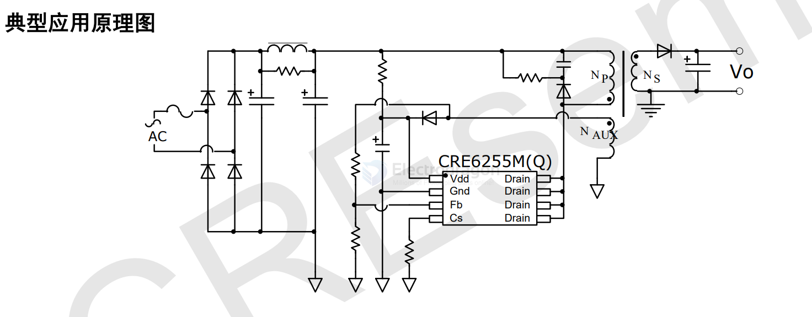

# cresemi-dat

- [[CRE6255-dat]] - [[CRE6905-dat]] - [[cresemi-dat]] - [[power-adapter-dat]]

- [[CRE6203-dat]]

## CRE6255 

- datasheet == [[CRE6255-DS.pdf]]

CRE6255Mx(Q)系列产品是一款内置高压MOS 功率开关管的高性能多模式原边控制的开关电源芯片。该产品方便用户以较少的外围元器件、较低的系统成本设计出高性能的交直流转换开关电源。

CRE6255Mx(Q)系列产品提供了极为全面和性能优异的智能化保护功能，包括逐周期过流保护、软启动、芯片过温保护、输出过压保护功能、VDD 欠压锁定保护功能、VDD 过压锁定保护功能。 CRE6255Mx(Q)系列产品提供精确的恒定电压，恒定电流（CV/CC）输出，无需光耦和二次侧控制电路以及环路补偿电路，同时保持了良好的稳定性。该芯片可以实现良好的输出电压调节和较高的平均效率，以及小于75mW 的待机功耗。 

RE6255Mx(Q)系列产品具有输出线损补偿功能. 线损补偿量可以通过调节Fb 分压电阻阻值来调节。

此外，芯片独特的PWM/PFM 工作模式使得音频能量最小化，全负载内无音频噪声。

CRE6255Mx(Q)系列产品采用 SOP-8 封装，为需要超低待机功耗的高性价比反激式开关电源系统提供了一个很好的设计平台，非常适合满足六级能效Level6 和欧洲节能标准Eur2.0 的应用。

## CRE6905 

The CRE6905 is a family of highly integrated Synchronous Rectification (SR) controller ICs manufactured by CRE Semiconductor, commonly used in high-performance power adapters (like PD and QC3.0 chargers) to improve efficiency.

CRE6905DH(P) series is a high performance secondary side synchronous rectfier chip, integrated with synchronous rectfier MOS, suitable for isolated synchronous rectifier applications, especially for high efficiency in charger applicafions.

CRE6905DH(P) series products adopt primary side opening judgment and secondary side discontinuous judgment technology, which can effectively avoid driver chip Wrong operation caused by excitation oscillation.

The CRE6905DH(P) series adopts the unique VCC power supply technology, which can ensure that the chip will not run out of power when the primary control system is in constant current and constant pressure.In addition, the CRE690SDH(P) series also integrates VCC under-voltage protection, overpressure clamp,and drive output interference elimination technology The CRE6905DH(P) series is packaged in SOP-8.

APPLICATION
- Flyback converters
- Adaptors

FEATURES
> Supports DCM and Quasi-Resonant Flyback converter
> Integrated Power MOSFET
> Supports High-side and Low-side Rectfication
> Supports High-side and Low-side Rectfication
> No need external power supply

## app 

## ref 

