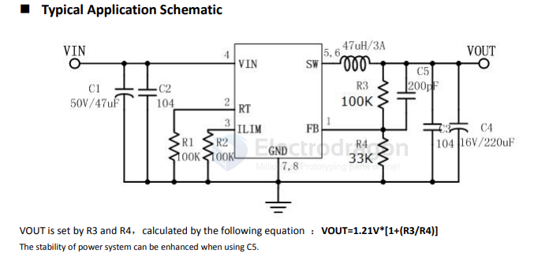
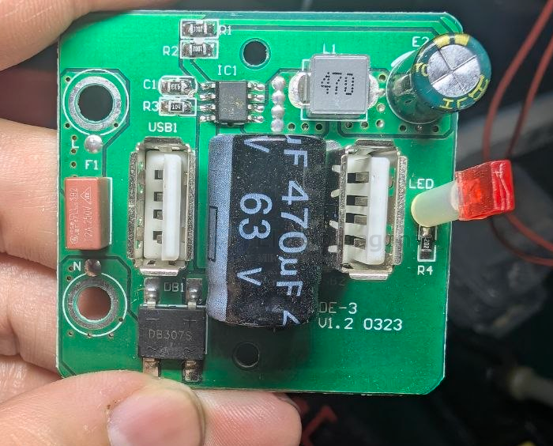

# developer-dat

- [[developer-dat]] - [[dcdc-down-dat]] - [[DP3115-dat]]

- [[car-charger-dat]]

## DP3115 

DP3115 integrates a high efficiency synchronous step-down switching regulator, which includes a 40V, 80mΩ high side P-MOS and a 40V, 39mΩ low side N-MOS to provide 2.5A continuous load current over 10V to 40V wide operating input voltage with 38V input over voltage protection. Conductance Peak current mode control provides fast transient responses and cycle-by-cycle current limiting. 

DP3115 has configurable line drop compensation, configurable charging current limit. A simple Power system with few external components is possible with DP3115.

## build 

- [[rectifier-dat]] 

## ref 