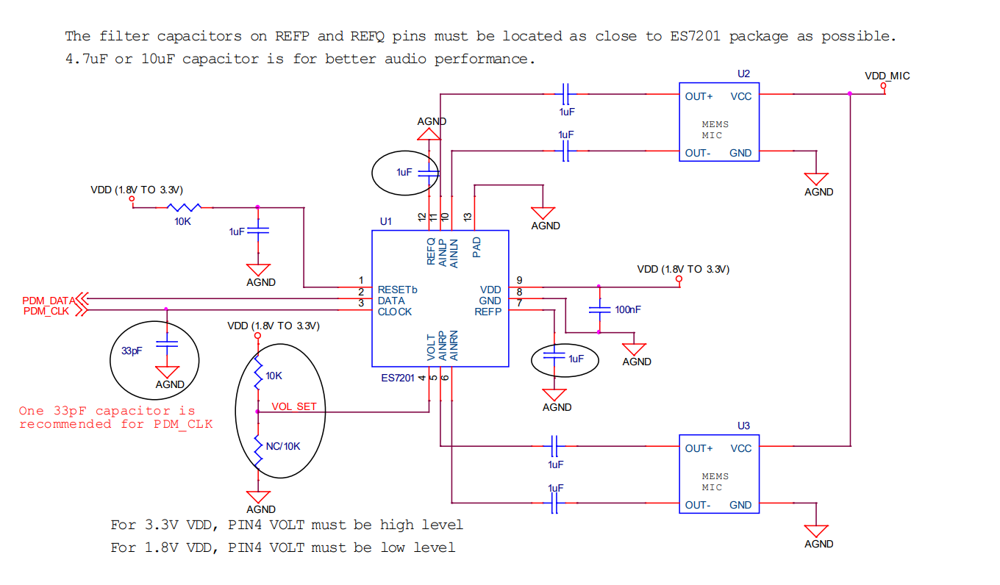

# ES7201-dat

- [[adc-dat]] - [[pdm-dat]] - [[pga-dat]] - [[audio-dat]]

High Performance PDM Stereo Audio ADC

FEATURES
- • High performance advanced deltasigma audio ADC
- • 90 dB dynamic range at 26 dB PGA
- • -85 dB THD+N
- • Low noise PGA
- • 8 to 96 kHz sampling frequency
- • Low power

APPLICATIONS
- • Mic Array
- • Soundbar
- • Audio Interface
- • Digital TV
- • A/V Receiver
- • DVR
- • NVR

## std app 

## app 1. 

## ref 

