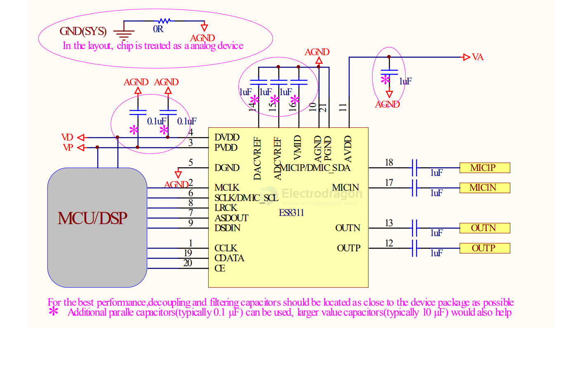
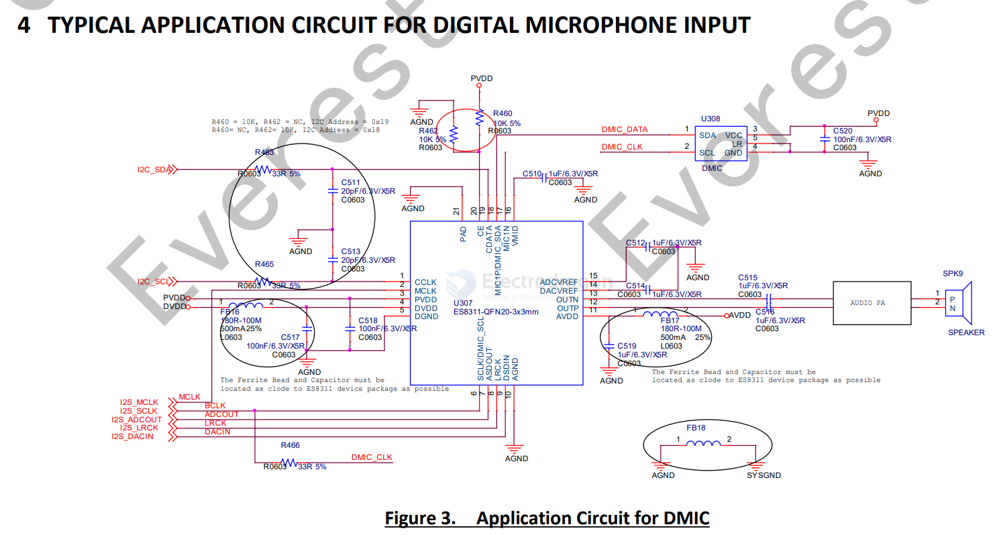
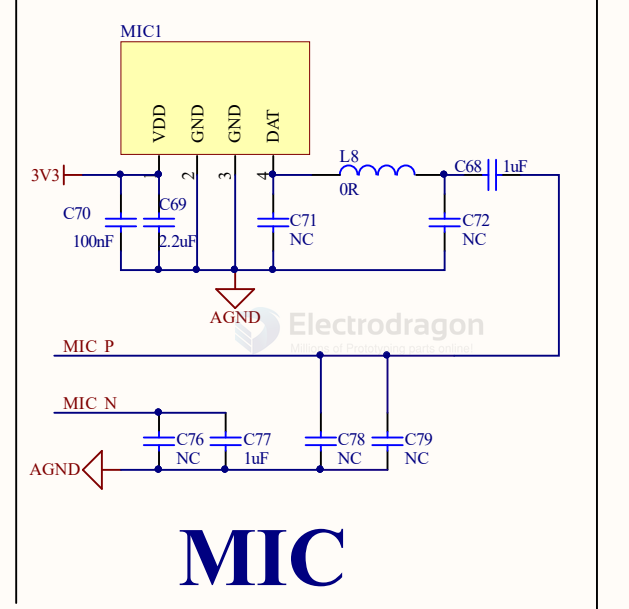
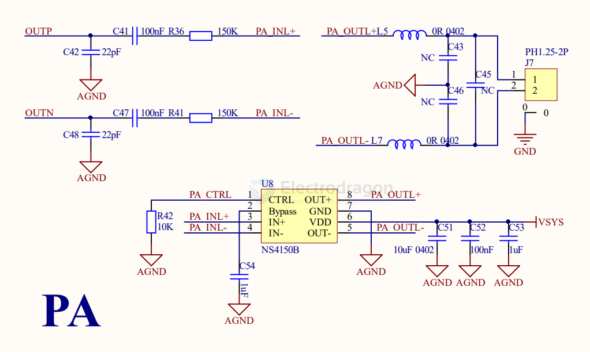
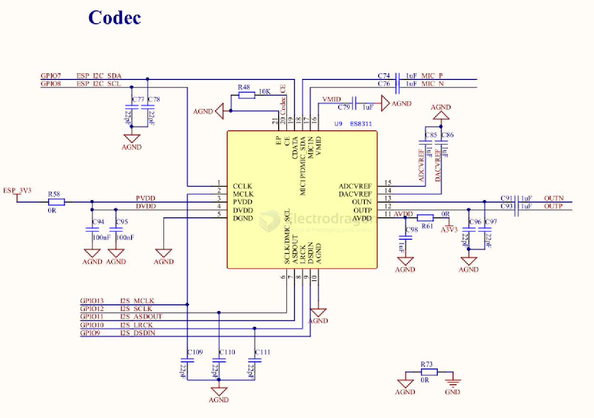

# ES8311-dat

- [[adc-dat]] - [[DAC-dat]] - [[record-dat]] - [[playback-dat]] - [[everest-semi-dat]]

- [[audio-dat]] - [[ES8311-dat]]

- [[sensor-microphone-dat]] - [[sensor-microphone-Analog-dat]]

- [[ES8311-SDK-dat]] - [[ES8311-dat]] - [[everest-semi-dat]] - [[ES7201-dat]] - [[codec-dat]]

## board 

- [[SSL1080-dat]]

## ES8311 

refer use guide in [[I2S-SDK-dat]]

Low Power Mono Audio CODEC

FEATURES

System

- High performance and low power multibit delta-sigma audio ADC and DAC
- I2S/PCM master or slave serial data port
- 256/384Fs, USB 12/24 MHz and other non standard audio system clocks
- I2C interface

http://www.everest-semi.com/pdf/ES8311%20PB.pdf

## pins to ESP32-S3

    ESP32S3开发板（16MFLASH) - ES8311-NS4150B-CODEC音频模块 - 说明
    
    GPIO_NUM_5 -- SDA -- 串口数据信号线
    GPIO_NUM_4 -- SCL -- 串行数据位时钟/DMIC位时钟
    GPIO_NUM_6 -- MCLK -- 主时钟
    GPIO_NUM_14 -- SCLK -- 位时钟
    GPIO_NUM_11 -- DIN -- 数据输入
    GPIO_NUM_12 -- LRCK -- 片选
    GPIO_NUM_13 -- DOUT -- 数据输出
    5V/5Vin（如有供电引脚） -- SV -- 电源，NS4150B音频功放供电
    GND -- GND -- 负极/接地

## ref 

- [[everest-semi-dat]]

# ES8311-dat

`ES8311` - 

The ES8311 is a low-power mono audio codec with fully differential output and headphone amplifier, as well as analog inputs that are programmable in fully differential configurations.

The record path of the ES8311 contains `one fully differential input`, analog digitally controlled mono microphone `preamplifier`,and automatic gain control (`ALC`). Programmable filters are available during record which can remove audible noise.

The `playback` path includes a mono DAC, through programmable volume controls, to the fully differential output. The fully differential output of ES8311 has a capability to drive 16Ω or 32Ω headphone load.

ES8311 is optimized for voice playback/record, so that it is very suitable for surveillance and voice application, such as car DV, IPCAMERNA, DVR, NVR, Baby monitor, intelligent toy, intelligent Robert, etc.

ADC `RECORD` FUNCTIONS

3. 100dB SNR, -88dB THD+N
4. Differential analog input
5. Low noise PGA for analog line in or microphone in
6. Noise reduction filters
7. ALC with Noise gate
8.  Supports analog and digital microphone interface

DAC `PLAYBACK` FUNCTIONS

9. 110dB SNR, -85dB THD+N
10. Dynamic Range Compression for analog output
11. Differential Line Out with 16 Ω/32 Ω headphone driver
12. Pop and click noise suppression
13. ADC data can be routed to DAC.
14. DAC data can be routed to Digital Serial Output Port

## diagram 

## SCH 

digital microhpone 

## APP 1. 

## SCH 2 

## ref 

- datasheet == [[ES8311.user.Guide.pdf]]

