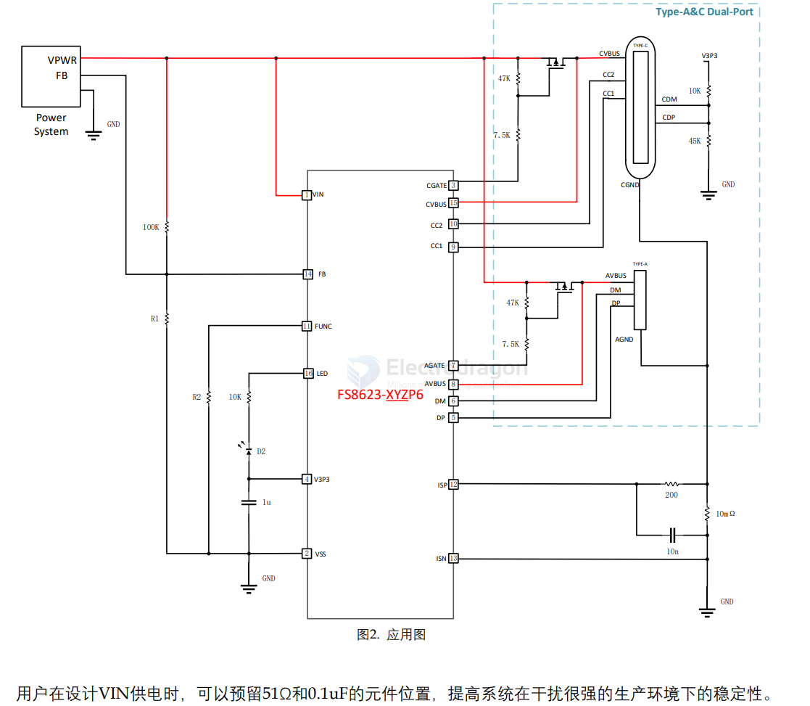

# FS8623-dat

- [[fastsoc-dat]] - [[FS8623-dat]] - [[fast-charge-protocols-dat]] - [[power-bank-dat]] - [[power-adapter-dat]] - [[power-dat]] - [[acdc-dat]]

datasheet == [[FS8623-datasheet.pdf]]

FS8623 属于速芯微 FSFC 系列，芯片选择性的兼容
主流的充电协议。芯片可以智能的识别插入的手机
类型，选择最为合适的协议应对手机需要。
FS8623 同时支持 Type-A 口和 Type-C 口。其中 A 口
包含芯片所有 A 口协议。C 口包含芯片支持的所有
C 口协议，C 口中的 D±可以支持 5V 充电模式。
芯片具有恒压和恒流功能，使用 FB 调压。
芯片的 D±和 CC 耐压分别高于 12v 和 30v，具有极
高的可靠性。同时，FS8623 带有过温、过流、过压、
欠压、放电等保护功能。
FS8623 的供电范围最小 3v，最大 21v，适应各种快
充协议的输出电压。
FS8623 将常见的 TypeC PDO 设置交给用户选择，
用户可以根据应用需要，通过配置 FUNC 脚外接电
阻，选择不同的系统设置。
FS8623 提供丰富的配置供用户选择。
FS8623 提供 SSOP16 和 QFN3X3-16L 封装，方便用
户合理安排方案

## ref 

