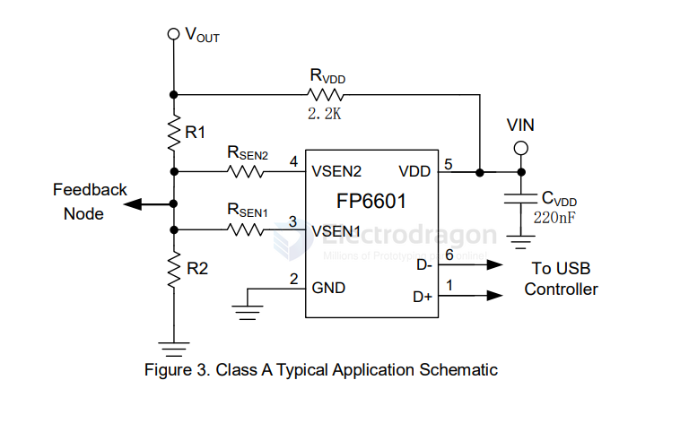
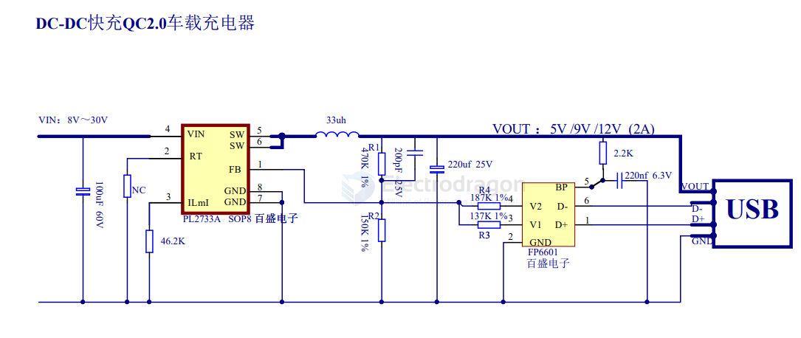
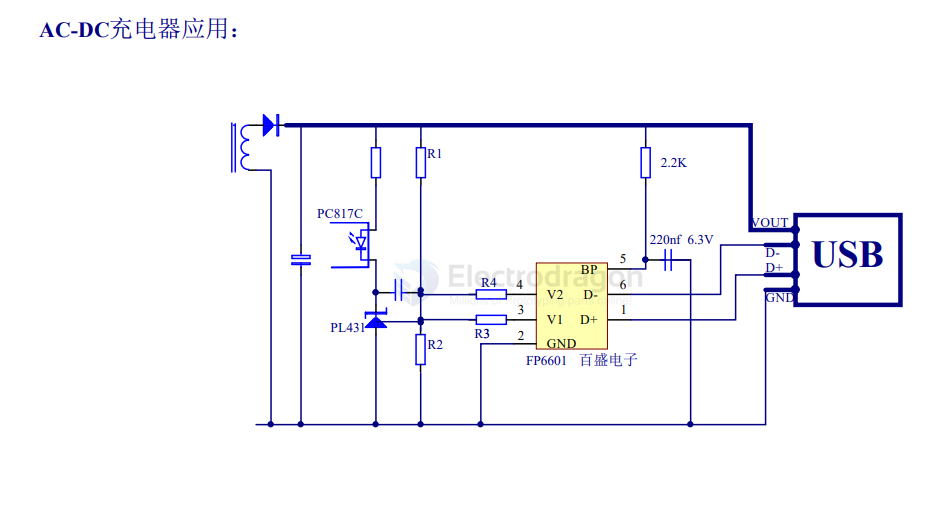

# fitipower-dat

The FP6601 is a fast charge protocol controller and follows Quick Charge 2.0 specification for smart power bank application. The protocol feature monitors USB D+/D- data line voltage, and automatically adjusts output voltage of power bank and wall adaptor to optimize charge time. 

- [[USB-QC2.0-dat]] - [[USB-SDK-dat]]

FP6601 can support not only USB BC compliant devices, but also Apple / Samsung devices and automatically detects whether a connected powered device (PD) is Quick Charge 2.0 capable before enabling output voltage adjustment. 

If a PD not compliant to Quick Charge 2.0 is detected the FP6601 disables output voltage adjustment to ensure safe operation with legacy 5 V only USB PDs.

The FP6601 is available in a space-saving SOT-23-6 package.

- [[ACDC-dat]] - [[app-dat]]

- [[fast-charge-protocols-dat]] - [[USB-QC2.0-dat]]