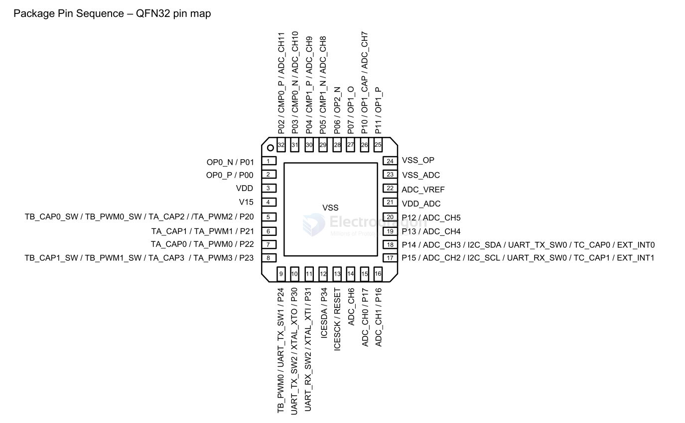

# GPM8FD3331B-dat

- [[GPM8FD3331B-dat]] - [[generalplus-dat]] - datasheet == [[GPM8F3331BV03_ds.pdf]]

- [[GPM8FD3331B-dat]] - [[generalplus-dat]] - [[power-wireless-dat]]

`GPM8F3331B` - 48 / 32 Pin 8-bit Microcontroller with 32KB Flash

## General Description

GPM8F3331B, a highly integrated microcontroller, features a pipelined 1T 8051-based CPU, 3K-byte XRAM, 256-byte IDM SRAM, and 32K-byte program FLASH into a single chip.  It supports up to 29 programmable multi-functional I/Os, Timer0/1/A/B/C, UART0 ,SPI,  I2C (master/slaver), 3 sets internal gain OP, 2 sets of Comparator, 65.3824MHz PLL, XTAL8M , IOSC32K and 1 set of 13-channle SAR ADC with 12-bit resolution for application. It operates over a wide voltage range of 2.4V - 5.5V with variety of clock sources.  It also provides one power saving mode in power management unit to manage power consumption more efficiently. Moreover, there is an on-chip debug circuit with two pins equipped to facilitate a full speed in-system debug while in application development phase.

## Features

### A/D Converter
- One 13-channel 12-bit resolution ADC
- Supports programmable sample & hold and ADC clock function
- Control independent per set
- Internal VSS channel
- Offset calibration
- Direct memory access from ADC to XRAM

### Built-in Low Voltage Detection
- Programmable level: 2.6V, 3.0V, 3.4V, 4.4V

### Built-in Low Voltage Reset
- Trigger level: 2.4V, 2.8V, 3.2V, 4.2V

### Clock Management
- Internal oscillator: 8MHz±2% @ 4V~5.5V
- Internal oscillator with PLL: 65.3824 / 63.85 / 60.019 / 52.357 MHz
- Crystal input with 8MHz
- Internal oscillator: 32KHz ± 50% @ 4V~5.5V

### CPU
- High speed and high performance 1T 8051-based CPU
- 100% software compatible with industry standard 8051
- Pipeline RISC architecture to execute instructions 10 times faster than standard 8051
- Up to 65.3824MHz clock operation

### I/O Ports
- 29 multifunction bi-direction I/Os
- Each incorporates with pull-up resistor, pull-down resistor, output high, output low, output driving capability and floating input, determined by user’s settings at the corresponding registers
- I/O ports with 15mA or 8mA current sink @ VDD = 5V
- I/O ports with 15mA or 8mA current drive @ VDD = 5V

### I2C (master / slaver mode)
- Programmable master I2C clock frequency
- Max I2C clock: 400 KHz

### Interrupt Management
- 12 interrupt sources
- 2 external interrupt sources

### Memory
- 3K bytes XRAM
- 256 bytes internal Data Memory (IDM) SRAM
- 32K bytes FLASH with high endurance
- Minimum 100,000 program/erase cycles
- Minimum 10 years data retention
- 512 Byte page size
- Programmable read only level for software security

### On-chip Debug Unit
- C compatible development tools

### Power Management
- One Sleep mode for power saving

### Programmable Watchdog Timer
- A time-base generator
- An event timer
- System supervisor

### Reset Management
- Power On Reset (POR)
- Low Voltage Reset (LVR)
- Pad Reset (PAD_RST)
- Watchdog Reset (WDT_RST)
- Software Reset (S/W_RST)
- FLASH Access Error Reset (ADDR_ERR_RST)

### SPI (master / slaver mode)
- Programmable phase and polarity of master clock
- Programmable master SPI clock frequency

### Three Ops
- Internal gain included
- Resistance between OP_O and CMP_N/ CMP_P input path included

### Three Powerful Timers: TimerA / TimerB / TimerC, with 16-bit Compare / Capture / PWM Unit
- Timer mode with selectable clock source
- Auto-reload 16-bit timers
- Event capturing
- Pulse width modulation and measurement
- TimerA providing 4 channels PWM/Capture
- TimerB providing 2 channels PWM/Capture
- TimerC providing 2 channels Capture

### Two 16-bit Timers/Counters (Timer 0/1)
- Timer mode with selectable clock sources
- Auto reload 8-bit timers

### Two Comparator
- Programmable hysteresis and de-bounce select
- Programmable input source select.

### UART0
- One synchronous mode
- Three asynchronous modes

## pins 

## ref 

