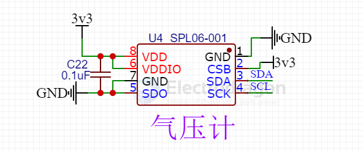

# SPL06-001-dat

https://media.digikey.com/pdf/Data%20Sheets/Goertek%20Microelectronics%20PDFs/SPL06-001.pdf

The SPL06-001 is a miniaturized Digital Barometric Air Pressure Sensor with a high accuracy and a low
current consumption. The SPL06-001 is both a pressure and a temperature sensor. The pressure sensor
element is based on a capacitive sensing principle which guarantees a high precision during temperature
changes. The small package makes the SPL06-001 ideal for mobile applications and wearable devices.

The SPL06-001‘s internal signal processor converts the output from the pressure and temperature sensor
elements to 24-bit results. Each pressure sensor has been calibrated individually and contains calibration
coefficients. The coefficients are used in the application to convert the measurement results to true
pressure and temperature values. 

[SPL06-MEMS-barometer-micropython](https://github.com/ChangboBro/SPL06-MEMS-barometer-micropython)

The SPL06 is a high precision MEMS barometer, its resolution of altitude can up to 5cm! (but I think maybe +-10cm, still very good)

## SCH 

