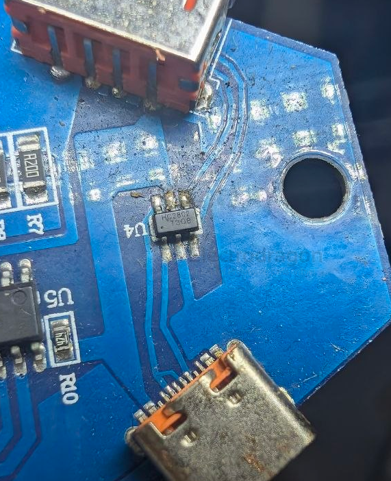
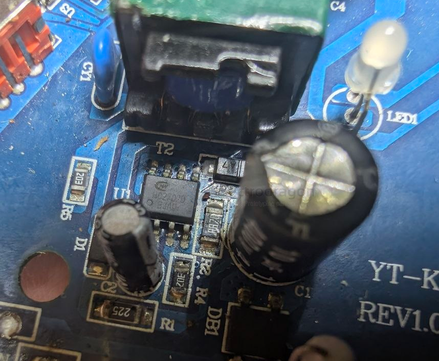

# hcwsemi-dat

[[hcwsemi-dat]] - [[power-usb-charger-dat]]

- [[hcwsemi-dat]] - [[HC2802-dat]]

https://www.hcwsemi.com/product/xy-ic.html

## HC2702D 

型号：	HC2702D
工作模式:	PSR
能效:	6
功能:	原边控制电源芯片
封装:	SOP-8
功率（W）:	10W
待机功耗（MW）:	75mw
工作电压:	85V-265V
应用:	充电器 适配器

## HC7703N ?? 

The HC7703N is a 2A synchronous rectification chip manufactured by 恒成微 (Hangchengwei) designed for power adapters and chargers. 

### Key Specifications

- Function: Synchronous rectifier / power management IC  
- Current Rating: 2A  
- Voltage Tolerance: 40V to 45V working voltage  
- Internal Resistance: 25 mΩ (milliohms)  
- Package Type: SOP-8 (Surface Mount)  
- Operating Temperature: -40°C to 150°C  
- Application: Low-power consumer electronics, AC-DC chargers, and adapters (typically around 10W output power)

- [[ACDC-dat]]

## HC7703H 

型号：	HC7703H
工作模式:	CCM、DCM、QR
功能:	同步整流芯片
封装:	SOP-8
功率（W）:	14W
工作电压:	45V
应用:	充电器 适配器
资料:	暂无资料

## ref 