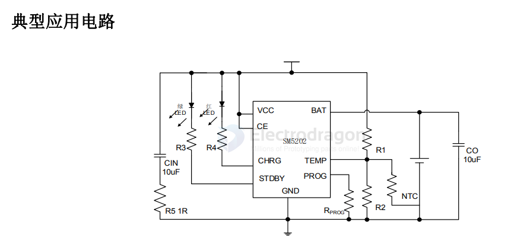
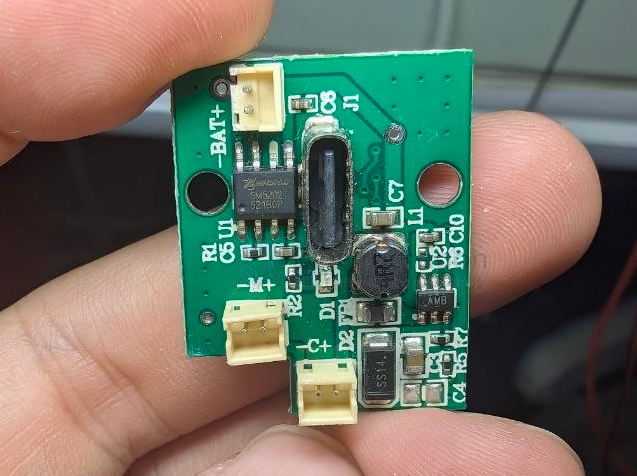

# SM5202-dat

- [[hichon-dat]] - [[SM5202-dat]] - [[battery-charger-dat]] - [[battery-charger-1s-dat]]

SM5202/SM5202EM/SM5202D

12V 耐压防反接及 OVP 功能 1A 锂电池线性充电芯片

简介

SM5202 是一款完整的采用恒定电流/恒定电压的单节锂电池线性充电器，并带有锂电池正负极反接保护功能，可以保护芯片和用户安全。

由于采用了内部 PMOSFET 架构，加上防倒充电路，所以不需要外部检测电阻和隔离二极管。热反馈可对充电电流进行调节，以便在大功率操作或高环境温度条件下对芯片温度加以限制。充电电压固定于 4.2V，而充电电流可通过一个电阻进行外部设置。当充电电流在达到最终浮充电压之后降至设定值 1/10 时，SM5202 将自动终止充电循环

当输入电压（交流适配器或 USB 电源）被拿掉时，SM5202 自动进入一个低电流状态，将电池漏电流降至 2μA 以下。也可将 SM5202 置于停机模式，从而将供电电流降至 45uA。SM5202 的其它特点包括充电电流监控器、欠压闭锁、过压保户、自动再充电和一个用于指示充电结束和输入电压接入的状态引脚。

特性

 锂电池正负极反接保护
 高达 1A 的可编程充电电流
 无需 MOSFET、检测电阻器或隔离二极管
 恒定电流/恒定电压操作，并具有可在无过热危险的情况下实现充电速率最大化的热调节

功能

 直接从 USB 端口给单节锂离子电池充电
 精度达到±1%的 4.2V 预设充电电压
 用于电池电量检测的充电电流监控器输出
 自动再充电
 充电输入电压过压保护
 2.9V 涓流充电
 软启动限制了浪涌电流
 C/10 充电终止；
 ESOP8/EMSOP8/DFN2X2‐8L 封装

应用范围

 移动电话、PDA、MP3 播放器
 充电座
 蓝牙应用
 其他手持设备

## SCH 

## build 

## ref 