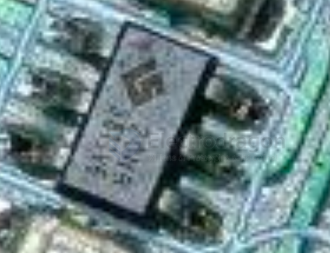
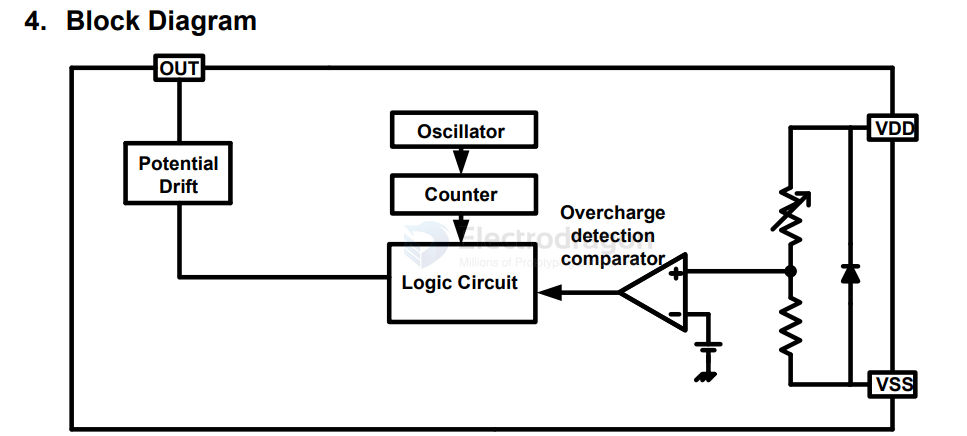
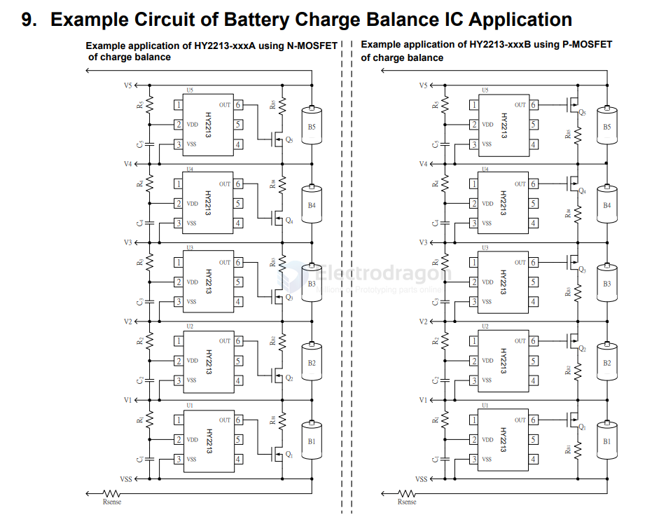
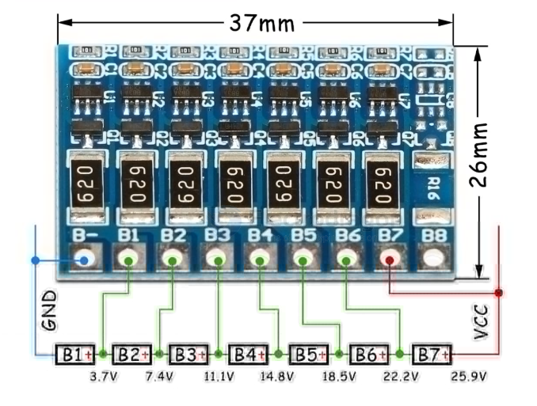

# hycontek-dat

https://www.hycontek.com

## 2S 

- [[battery-2s-dat]]

- [[HY2120-dat]] - [[hycontek-dat]]

HY2122 - Two-Cell Li-ion/Polymer Battery Protection

## 3-5S 

HY2540

HY2550 Series Features - High-accuracy voltage detection circuit for 3/4/5 Cell Application

- [[battery-3s-dat]]

Small package: 16-pin TSSOP

## balance IC

### HY2213 

== BB3A 

[HY2213](https://www.hycontek.com/hy_battery/DS-HY2213_EN.pdf)

The series of HY2213 is created for multi-cell battery packs to single-cell lithium-ion battery Charge balance control, electrical level monitoring ICs and it also comprises high-accuracy voltage detection circuit and delay circuit.

## boards 

## ref 

- [[battery-packs-dat]] - [[hycontek-dat]]

- [[IC-dat]]