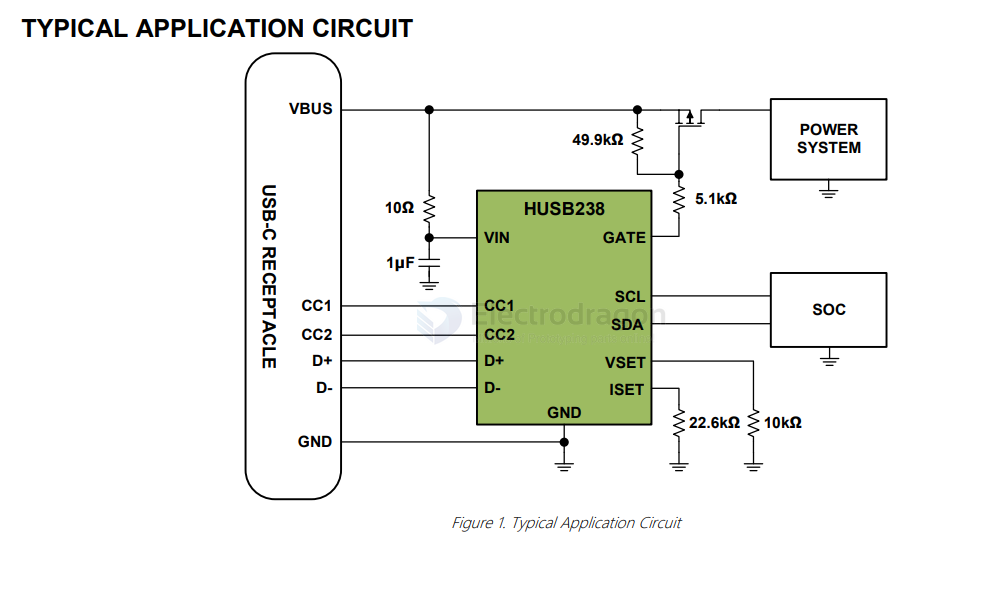
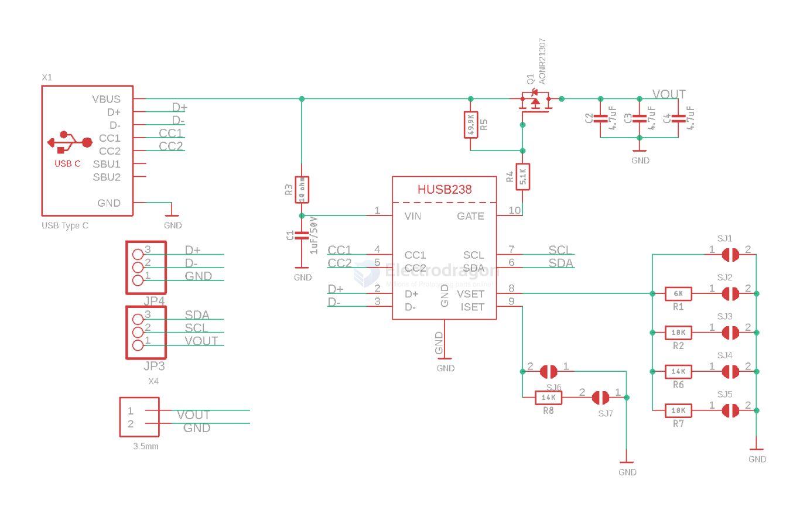
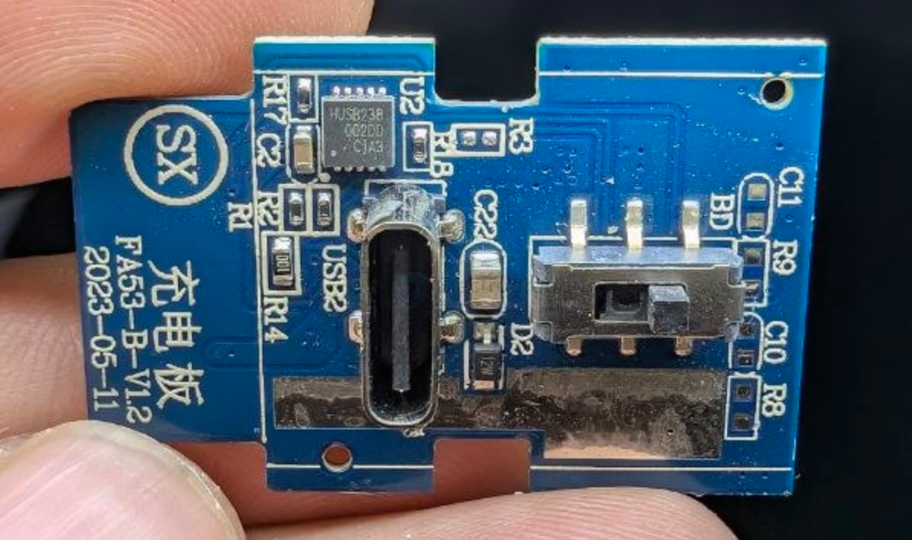

# HUSB238-dat

- [[hynetek-dat]] - [[HUSB238-dat]] - [[SC8906-dat]]

- [[hynetek-dat]] - [[HUSB238-dat]] - [[type-c-sniffer-dat]]

USB Type-C Power Delivery Sink Controller

APPLICATIONS
- PD sink devices
- USB-C cables
- Wireless charger

GENERAL DESCRIPTION

The HUSB238 is a highly integrated USB Power Delivery (PD) controller as sink role for up to 100W power rating.

The HUSB238 is compatible with PD3.0 and Type-C V1.4, and it can also support Apple Divider 3, BC1.2 SDP, CDP and DCP while the source is attached. The HUSB238 can be used in electronic devices that have legacy barrel connectors or USB micro-B connectors for power such as IoT (Internet of Things) devices, wireless charger, drones, smart speakers, power tools, and other rechargeable devices.

The HUSB238 is available in 3mm x 3mm DFN-10L and 3.9mm x 4mm SOT33-6L package options.

## SCH 

The `HUSB238` USB PD sink chip is neat in that you can either use jumpers (really, resistor selection) to set the desired PD voltage and current or you can use I2C for dynamic querying and setting. We've build a nice Adafruit USB Type C Power Delivery Dummy Breakout board around the HUSB238 to make it very easy to configure and integrate without having to solder any tiny resistors.

Adafruit HUSB238 USB Type C Power Delivery Breakout

## build 

this is one side - [[HUSB238-dat]] - this is one side - [[SC8906-dat]]

## ref 

