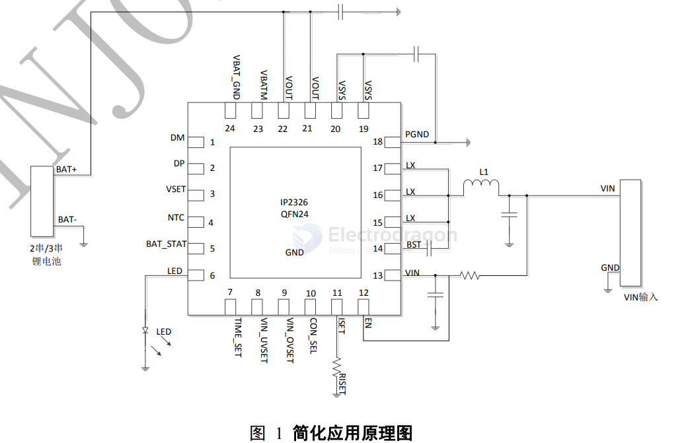
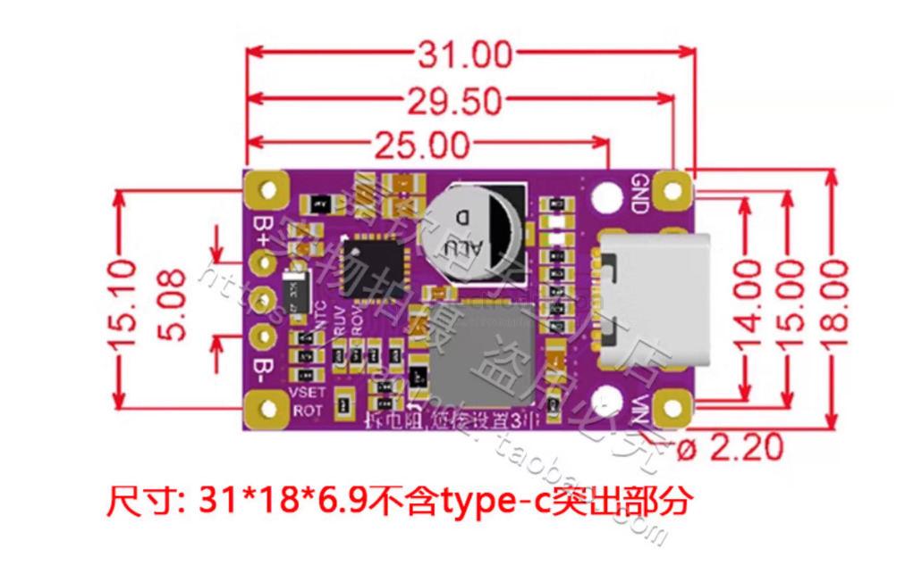

# IP2326-dat

- IP2326 - 支持 15W 快充的 2 节/3 节串联锂电池升压充电 IC == Boost Charging IC for 2/3 Serial Lithium Battery With 15W Fast Charge

- [[BMS-passive-dat]]

- [[battery-2s-dat]] - [[battery-3s-dat]] - [[battery-dat]]

- [[IP2326-dat]] - [[injoinic-dat]]

特性
-  15W 同步开关升压充电
-  升压充电效率 94%
-  功率 MOS 内置
-  集成充电均衡电路
-  支持输入快充申请，可根据电池电压申请快充输入，提高充电效率
-  恒压充电电压外部电阻可调节
-  引脚可设置 2 串或 3 串串联锂电池充电
-  充电电流外部电阻可调节
-  根据电池电压，自动申请快充输入
-  自动调节输入电流，自适应适配器负载
-  支持充电 NTC 温度保护
-  输入过压、欠压保护，外接电阻可调整
-  充电超时保护，外接电阻可调整
-  支持 LED 充电状态指示
-  500KHz 开关频率，可支持 2.2uH 电感
-  输出过流、过压、短路保护
-  IC 过温保护
-  输入耐压 25V
-  ESD 4KV

SCH 

## board 

## ref 

- [[IP2326]]

