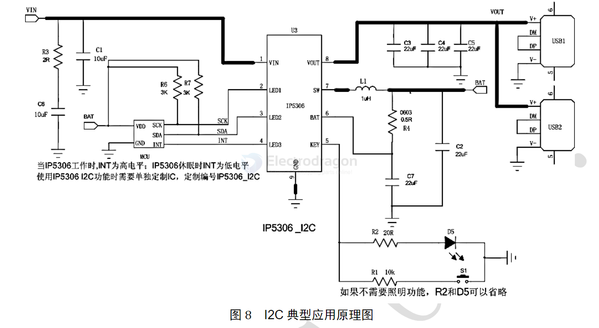

# IP5306-dat

- [[OPM1123-dat]] - [[NWI1241-dat]]

- DS: https://www.laskakit.cz/user/related_files/ip5306.pdf

## HDK 

- KEY = flashing LED output and key function as below 

Push button’s connecting is shown in Fig 5. IP5306 can identify long push and short push.

| **Feature**                                  | **Description**                                                                 |
|----------------------------------------------|---------------------------------------------------------------------------------|
| **No Key Required**                          | If no key is needed, PIN5 can remain floating.                                  |
| **Short Press (30ms - 2s)**                  | Activates the battery level indicator and boost output.                         |
| **Long Press (>2s)**                         | Turns the LED light on or off.                                                  |
| **Press Duration (<30ms)**                   | No response will be triggered.                                                  |
| **Double Short Press (within 1s)**           | Turns off the boost output, battery level indicator, and LED light.             |

## Typical SCH 

## versions 

- IP5306-I2C
- IP5306-LC
- IP5306       = 4.20V
- IP5306_4.30V = 4.30V
- IP5306_4.35V = 4.35V
- IP5306_4.40V = 4.40V

## Note 

- battery need to be attached and "activate" by charging first 
- MAKE SURE to use high quality, full charged battery for testing, otherwise could cause power off 
- The board does not supports modern quick charging options, like QC, PD, etc 

- to prevent board enter into sleep mode automatically for small power load, you can add some more load resistors to keep it continuously on.

- this chip has two version: LED version or I2C version, normllay we only provide LED-version 

## IP3506-I2C 

- LED1 = SCL
- LED2 = SDA 
- LED3 = detect the sleep mode 

- [[IP5306-I2C-DS.pdf]]

### SCH 

## ref 

- [[solutions-dat]]