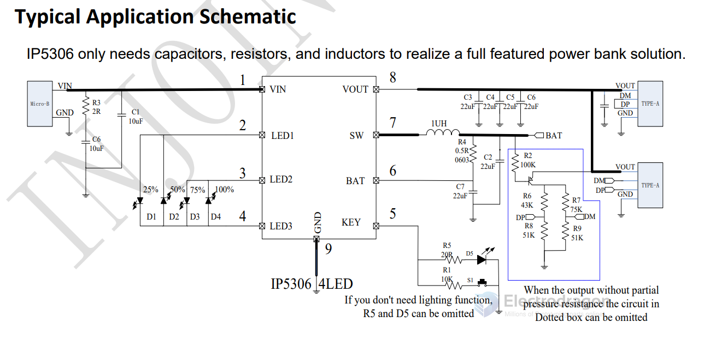
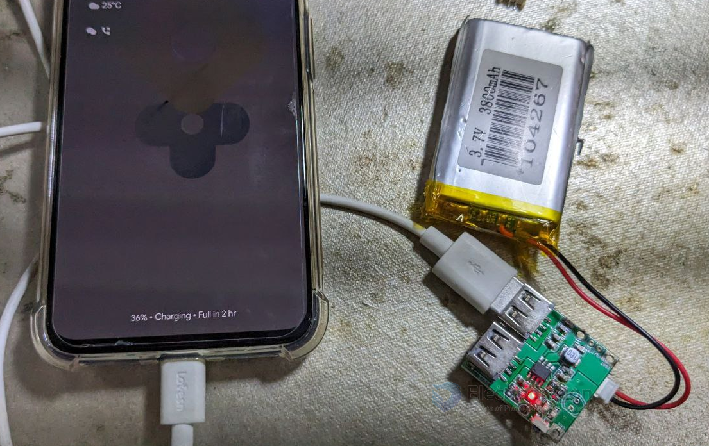

# IP5306-dat

- [[OPM1123-dat]] - [[NWI1241-dat]]

- DS: https://www.laskakit.cz/user/related_files/ip5306.pdf

## Press button 

Push button’s connecting is shown in Fig 5. IP5306 can identify long push and short push.

| Button Action In                                                                                         | System Action Out                                                             |
| -------------------------------------------------------------------------------------------------------- | ----------------------------------------------------------------------------- |
| If button is pushed longer than 30ms but shorter than 2s, IP5306 will identify the action as short push. | Short push will open SOC indicator LEDs and step-up converter                 |
| If button is pushed longer than 2s, IP5306 will identify the action as long push.                        | Long push will close step-up convertor, SOC indicator LED and flashlight LED. |
| If button is pushed shorter than 30ms                                                                    | IP5306 will ignore the action.                                                |
| If two short push is detected within 1s                                                                  | IP5306 will open or close flashlight LED                                      |

## Typical SCH 

## Note 

- battery need to be attached and "activate" by charging first 
- MAKE SURE to use high quality, full charged battery for testing, otherwise could cause power off 
- The board does not supports modern quick charging options, like QC, PD, etc 

- to prevent board enter into sleep mode automatically for small power load, you can add some more load resistors to keep it continuously on.

- this chip has two version: LED version or I2C version, normllay we only provide LED-version 

## ref 

- [[solutions-dat]]