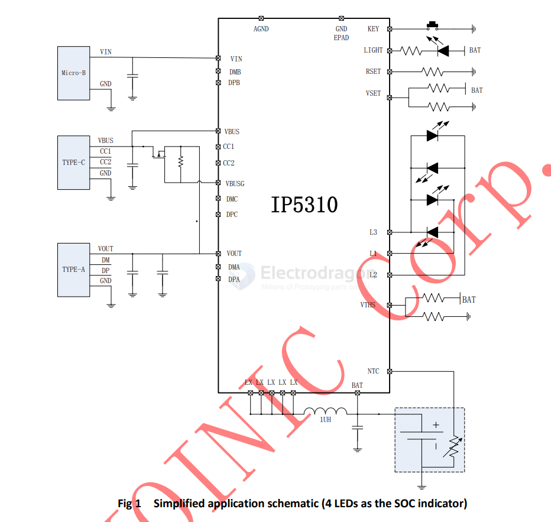

# IP5310-dat

- [[IP5310-dat]] - [[power-bank-dat]] - [[injoinic-dat]]

- [[IP5306-dat]] - [[IP5310-dat]]

Integrated USB TYPE-C Power Bank System-On-Chip with 3A charger, 3.1A discharger

datasheet == [[IP5310-datasheet.pdf]]

2. Applications
- Power bank, Portable Charger
- Mobile Phones, Smart Phones, Handheld Devices, Portable Media Player, Tablet

## ref 

