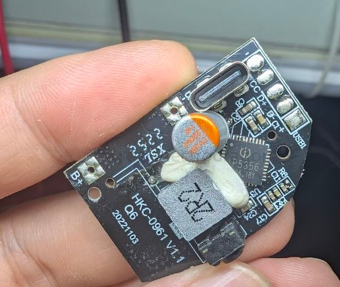
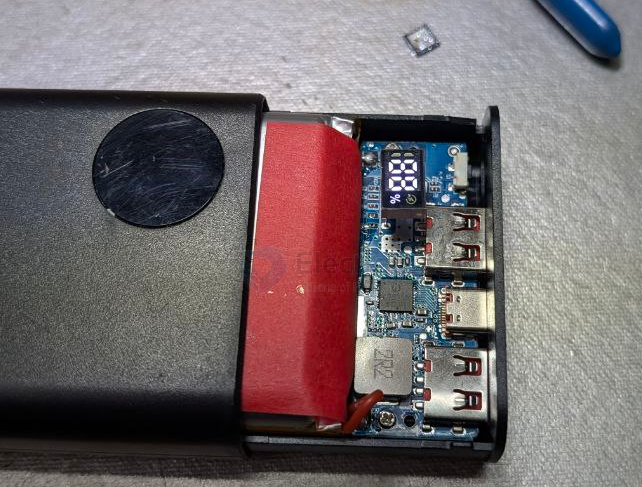
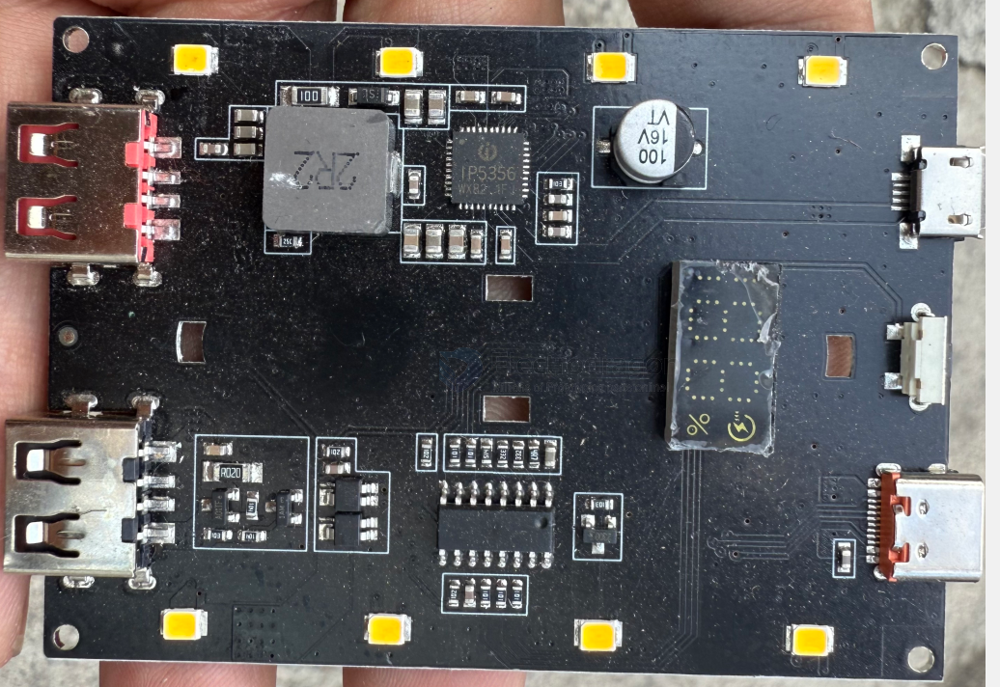
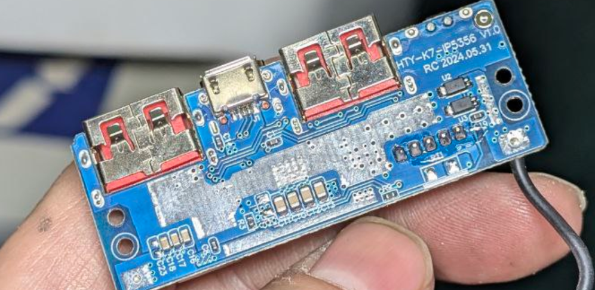
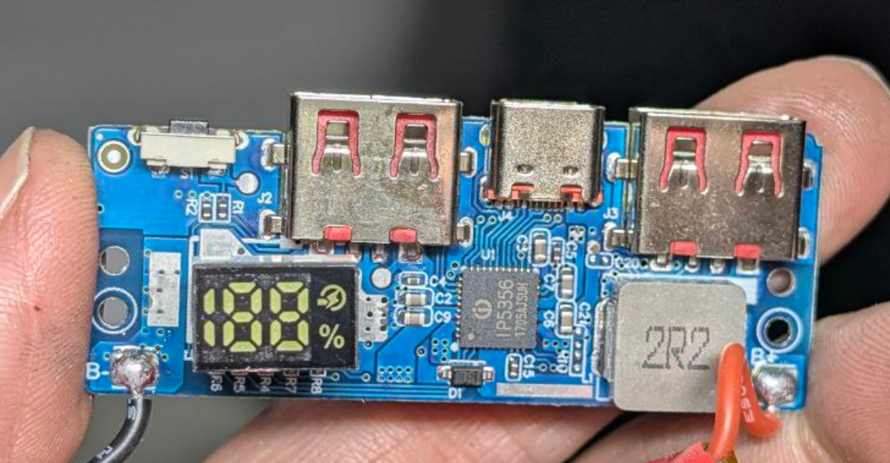
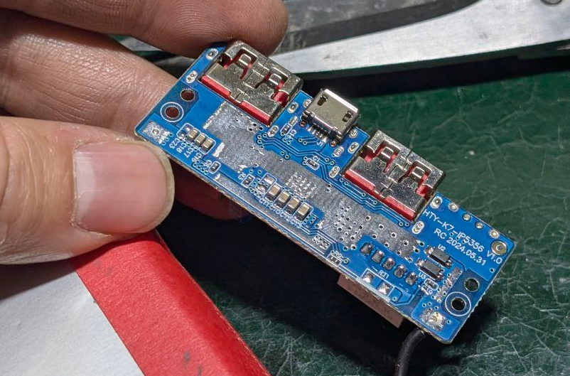
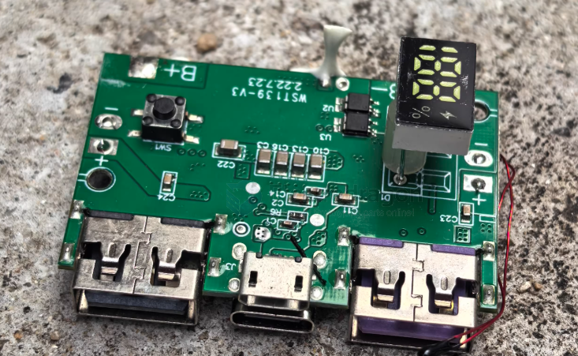
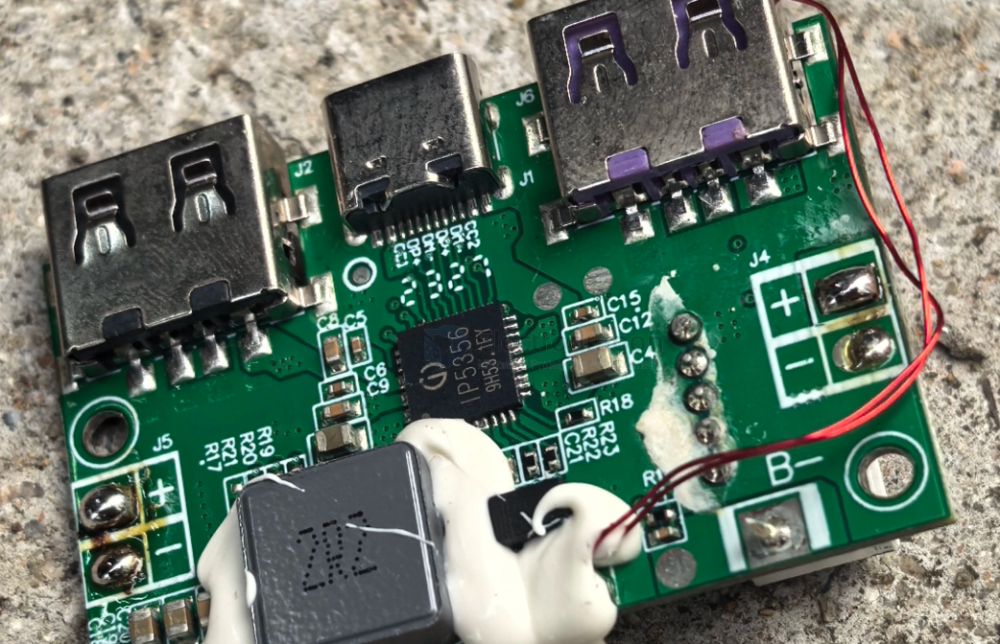
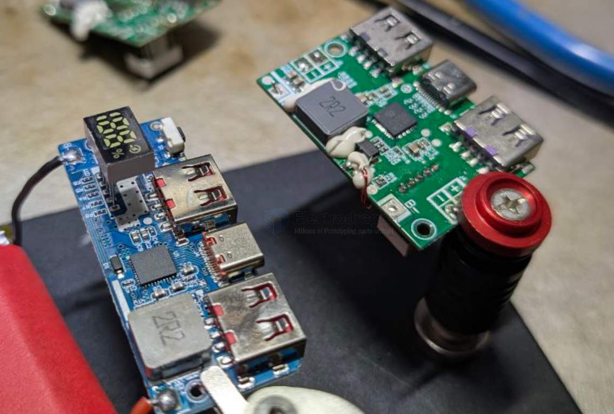

# IP5356-dat

- [[IP5356-dat]] - [[power-bank-dat]] - [[injoinic-dat]]

## build 5 

- [[mosfet-dat]] - [[XB4908-dat]] - [[IP5356-dat]]

## board 4 

## board 3 

## boards 

## board V2 

## error 

chip easily burn if wiring wrong

## ref 

- [[injoinic-dat]]