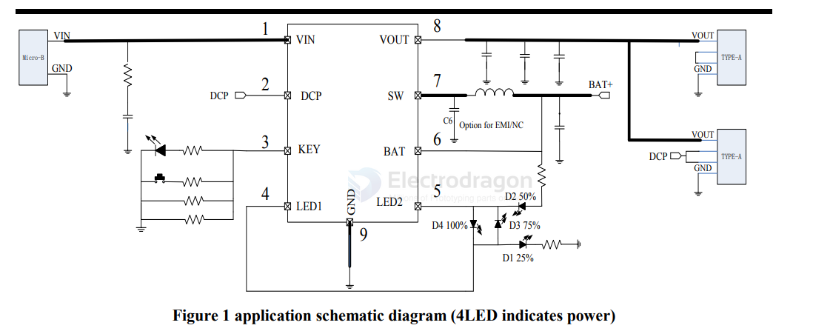

# IP5407-DAT

- [[IP5407-DAT]] - [[injoinic-dat]] - [[IP5306-dat]] - [[power-bank-dat]]

The `IP5407` is a highly integrated power management SOC (System on Chip) by Injoinic, widely used in DIY power banks and portable electronics. It combines a 2.1A/2.4A synchronous boost converter, lithium battery charge management, and multi-level battery power indication into a single chip.

2A charge 2.1A / 2.4A discharge integrated DCP function mobile power SOC

- datasheet == [[ip5407-datasheet-39350302.pdf]]

## ref 

