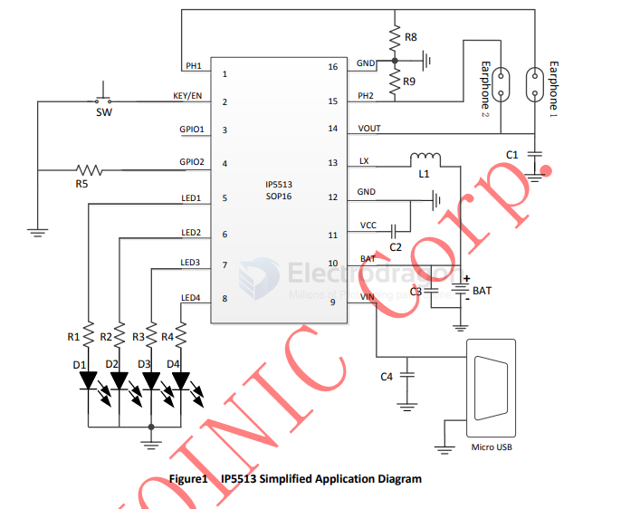
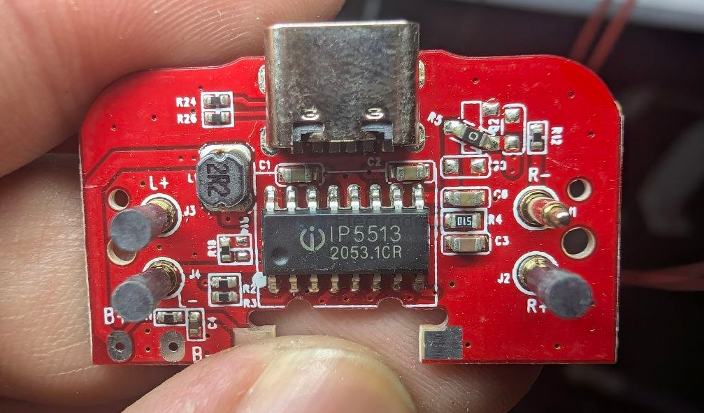
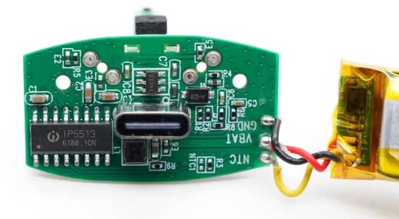

# IP5513-dat

- [[IP5513-dat]] - [[injoinic-dat]]

- [[earphone-dat]] - [[earphone-charging-box-dat]] - [[app-dat]] - [[injoinic-dat]]

IP5513 is a multi-functional power management SOC for total solution on TWS Bluetooth Earphone Charging Box. It integrates with 5V boost converter, lithium battery charging management and battery level indicators.

IP5513 is highly integrated with abundant
functions, which makes the total solution with
minimized-size and low-cost BOM.

The synchronous 5V-boost system of IP5513
provides rated 300mA output current with conversion
efficiency up to 93%. DC-DC converter operates at
1.5MHz frequency, can support low-cost inductors and
capacitors.

IP5513’s linear charger supplies max 500mA
charging current. With the change of IC temperature
and input voltage, IP5513 can automatically adjust the
charging current.

IP5513 can detects the TWS earphone plug-in in
the Chargering Box independently. While the
earphone is put in the Chargering Box, it enters the
discharging mode automaticaly. When the earphone is
fully charged, the Chargering Box automatically enters
the sleep state, and the standby current can be
reduced to 30uA. The earphone’s charge-end current
can be Flexible and customizable, charge-end current
detection accuracy is up to 1mA.

IP5513 can support 1/2/3/4 LED battery indicator
or 188 digital tube battery indicator. The built-in 10bits
ADC can accurately calculate the Chargering Box’s
battery capacity.

IP5513 is packaged with SOP16.

英集芯IP5333采用SOP16封装，简化生产工艺。芯片内置两路独立限流开关，无需外置限流芯片，耳机充满自动进入休眠节能，有效节省电池电量。

英集芯IP5513内置1.5MHz开关频率的同步开关升压转换器，升压效率最高达到93%，支持300mA输出电流，可满足TWS耳机快充需求。内置线性充电功能，支持500mA充电电流，充电电流可调且支持自适应调节，并支持4.2、4.3、4.35和4.4V电池，满足多种电池的使用需求。支持充电路径管理，可实现边充边放，优先为耳机充电，当电池电压过低时优先为电池充电。

 

IP5513内置10位ADC，可精确计量电池电量，支持1/2/3/4颗LED电量显示，并支持定制188数码管电量显示。芯片内部集成双路UART接口，可通过定制功能实现与耳机通信。芯片内置智能检测功能，可识别耳机插入/充满/取出，自动进入待机模式，节省电池电量。内置的检测功能支持双路耳机独立检测。

 

IP5513在单颗芯片实现充电盒完整功能的同时，还集成了全面完善的保护功能，包括输出过流保护、输出短路保护、输入端过压保护、芯片过热保护。输入端引脚支持15V耐压，可简化输入保护电路设计。

 

IP5513单芯片极好的解决了供应链管理的同时，完美解决了PCBA生产制造速度与良率，减少了后期维护成本。不仅可用于TWS耳机充电盒，还可以用于内置小容量锂电池的手持设备等，提供完善的电源管理。

## SCH 

## build 

build 2 

build 1 

14C1S 

## ref 

datasheet == [[IP5513-DS.pdf]]