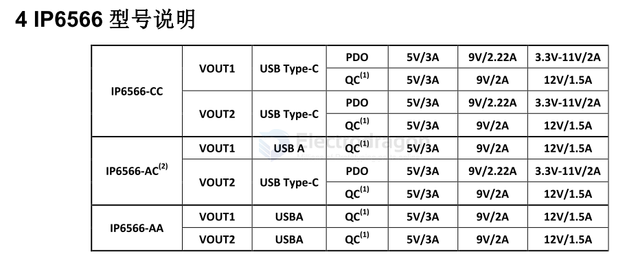
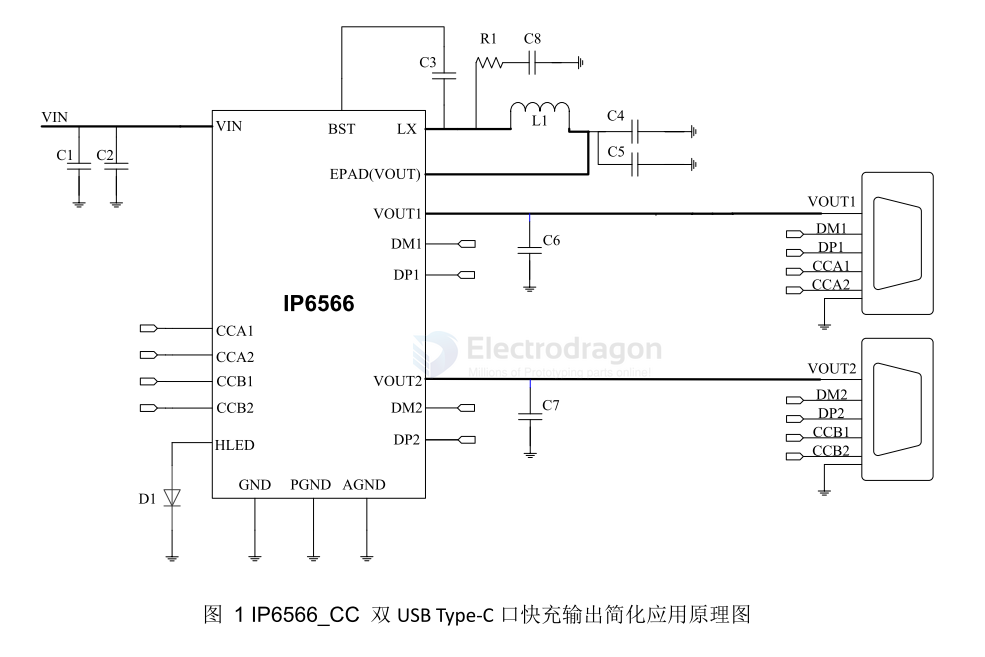
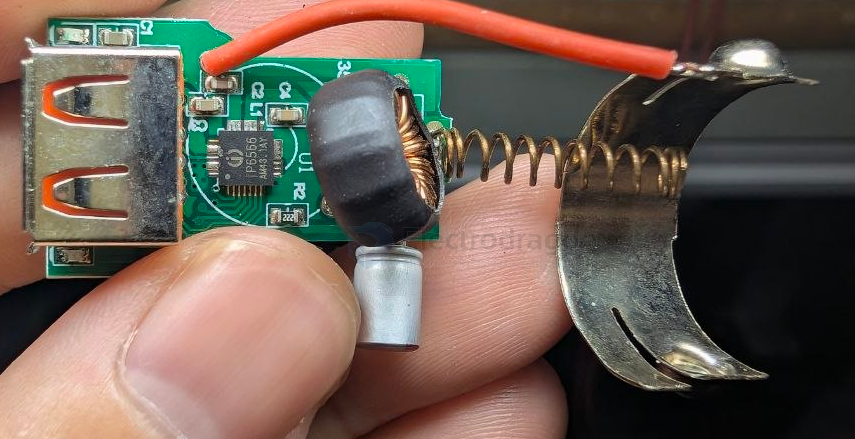
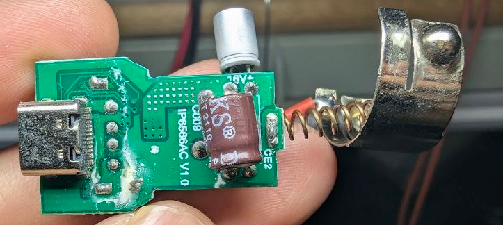

# IP6566-dat

同步开关降压转换器 
  内置功率 MOS 
  输入工作电压范围：8.2V 到 32V 
  输出电压范围：3V 到 12V，根据快充协议自动调整 
  输出电压有线补功能，50mV/A 
  PD 输出具有 CV/CC 特性（输出电流小于设定值，输出 CV 模式；输出电流大于设定值，输出 CC 模式） 
  VIN=12V，VOUT=5V/3A，板端转换效率为 93.8% 

双口快充输出 
  支持双 USB Type-C 输出 
  支持 USB Type-C 和 USB A 输出 
  支持双 USB A 输出 
  任意一个输出口都支持快充 
  双口自动插拔检测功能 

支持 Type-C 输出接口和 USB PD 协议 
  支持 5V、9V、12V 电压输出 
  支持 PD2.0/PD3.0(PPS)输出协议 
  PPS 支持 3.3V~11V，20mV/step 电压输出 

快充规格 
  支持 2 个 Type-C PD 口输出 
  支持 2 个 BC1.2、Apple 协议 
  支持 2 个高通 QC2.0 和 QC3.0 
  支持 2 个华为快充协议 FCP 
  支持 2 个华为快充协议 SCP 
  支持 2 个华为快充协议高压 SCP 
  支持 2 个三星快充协议 AFC 
  支持 2 个展讯快充协议 SFCP 

多重保护、高可靠性 
  输入过压、输入欠压、输出短路、输出过流保护和过温保护 
  DP/DM/CC 过压保护 
  CC PIN 耐压 30V 
  ESD 4KV，直流耐压 40V 

## IP6566 

IP6566是一款集成同步开关的降压转换器、支持多种输出快充协议、支持Type-C输出和USBPD2.0/PD3.0(PPS)协议的双口输出SOCIC，为车载充电器、快充适配器、智能排插提供完整的解决方案。

IP6566 支持双 USB Type-C，USB Type-C 和USB A，或者双USB A输出，集成双口自动插拔检测功能，单独使用任意一口都可支持快充输出，当双口同时使用时，双口都输出5V,总功率5V/3.4A。到32V，输出电压范围是3V到12V，最是提供IP6566内置功率MOS，输入电压范围是 8.2V

20W的输出功率，能够根据识别到的快充协议自动调整输出电压和电流。IP6566输出 5V/3A，板端转换效率高至93.8%。

IP6566的 PD输出具有 CV/CC 特性，当输出电流小于设定值，输出CV模式，输出电压恒定；当输出电流大于设定值，输出CC模式，输出电压降低。

IP6566的输出电压带有线补功能，输出电流增大后会相应提高输出电压，用以补偿连接线阻抗引起的电压下降。

IP6566具有软启动功能，可以防止启动时的冲击电流影响输入电源的稳定。

IP6566有多种保护功能，具有输入过压、欠压保护，输出过流、过压、欠压、短路保护等功能。IP6566 采用 4*4mm QFN28 封装。

## SCH 

## build 

## ref 

- datasheet == [[IP6566.PDF]]

