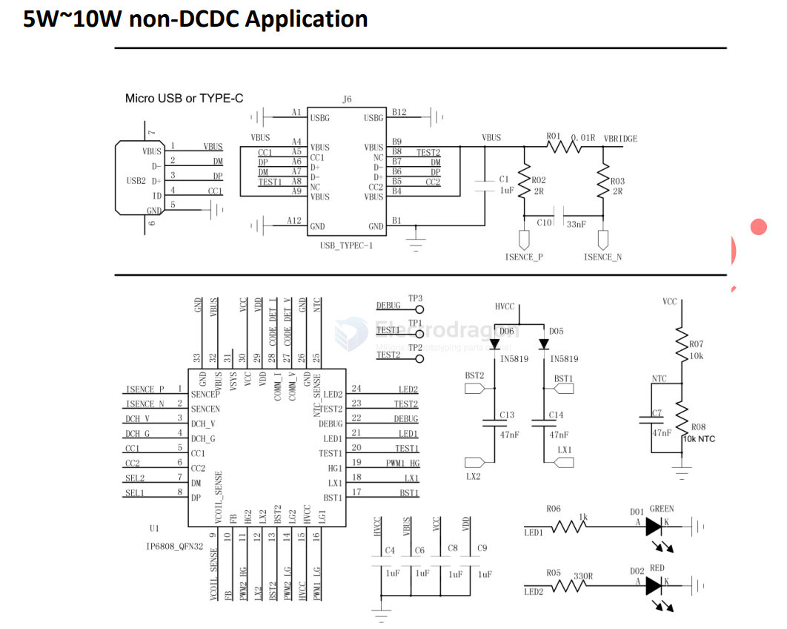
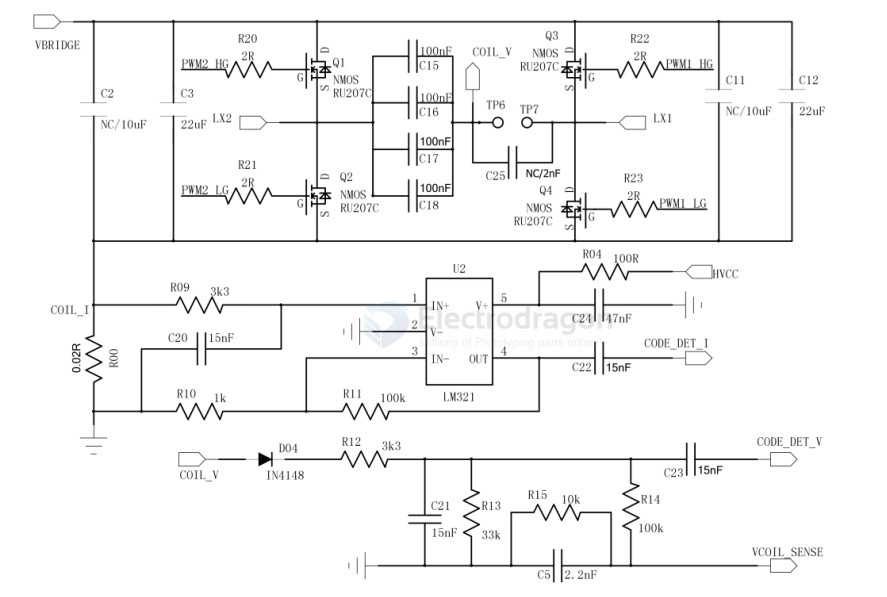
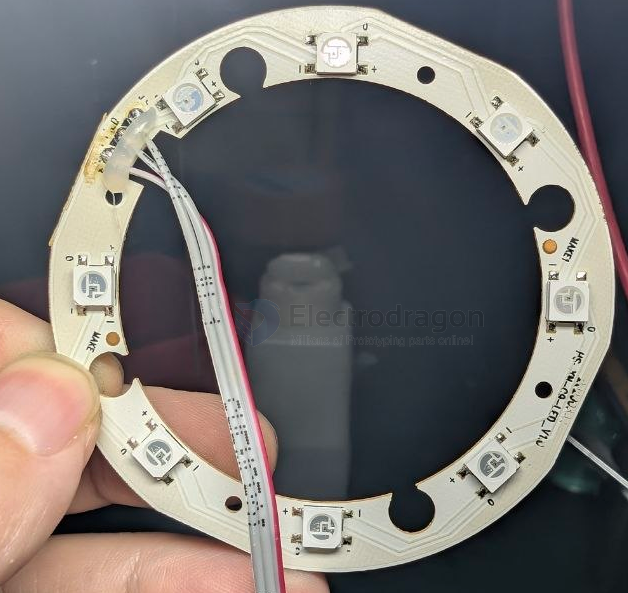
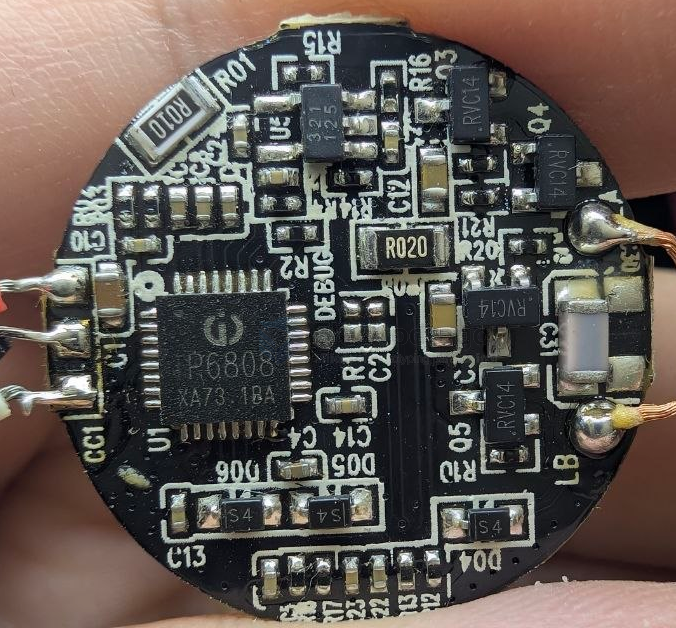
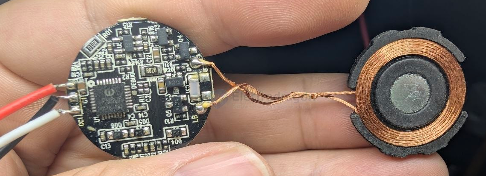

# IP6808-dat

- [[IP6808-dat]] - [[injoinic-dat]] - [[power-wireless-dat]]

Wireless Power Transmitter Compliant with WPC V1.2.4 protocol

Wireless Power Transmitter Compliant with WPC V1.2.4 protocol of 7.5W/10W

- datasheet == [[IP6808-datasheet.pdf]]

IP6808 is a wireless power transmitter controller SoC that integrates all required functions for the latest WPC Qi V1.2.4 specifications compliant wireless power transmitter design.

Support A11 coil, support 5W, Apple 7.5W, Samsung 10W charging. It used analog PING to detect a RX wireless device for charging with low standby power.

Once RX device is detected, the IP6808 establish a communication with the RX wireless device and controls the coil power transfer by adjusting operation frequency, depended on calculating the data packages, received from RX device, with PID algorithm. IP6808 terminate power transfer when RX device is fully charged.

IP6808 integrate full-bridge driver, includes voltage and current two-way ASK demodulation module, and input overvoltage/current protection and FOD module. IP6808 is a highly integrated SoC for small-size and low bom cost solutions and reduced time-to-market.

Features
-  Compliant with the WPC V1.2.4 specificatiosn transmitter design
-  Support 5~10W applications
-  Single 5W applications
-  Fast charge input for 5~10W applications
-  5V DC input for step-up of 5~10W output applications
-  9~15V DC input for step-down of 5~10W output applications
-  Input withstand voltage up to 25V
-  Integrate NMOS full bridge driver
-  Integrate voltage/current demodulator
-  Support FOD (Foreign Object Detection) function
-  High sensitivity
-  Support dynamic FOD
-  Adjustable FOD parameters
-  Low quiescent dissipation and high efficiency
-  4mA quiescent current
-  Charging efficiency is up to 79%
-  Compatible with NPO and CBB capacitors
-  Support online firmware upgrade
-  Support Dynamic Power Modulation (DPM) for insufficient USB power source
-  Support low voltage charger of 5V/500mA
-  Input overvoltage, overcurrent protection
-  Support PD3.0 input
-  Support NTC
-  2 LEDs for system states indication
-  Pacage: QFN32 5mm*5mm 0.5 pitch

## APP 

## build 

RVC14 == unknown SOT23-3

321 125 SOT23-5 == unknown

## ref 