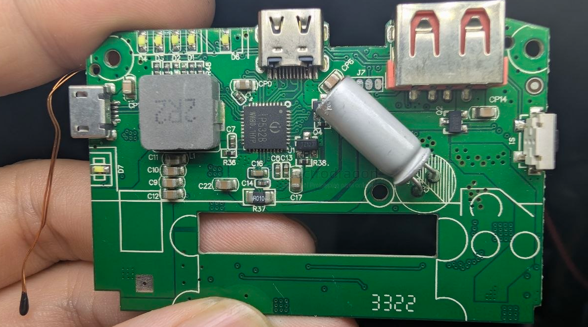
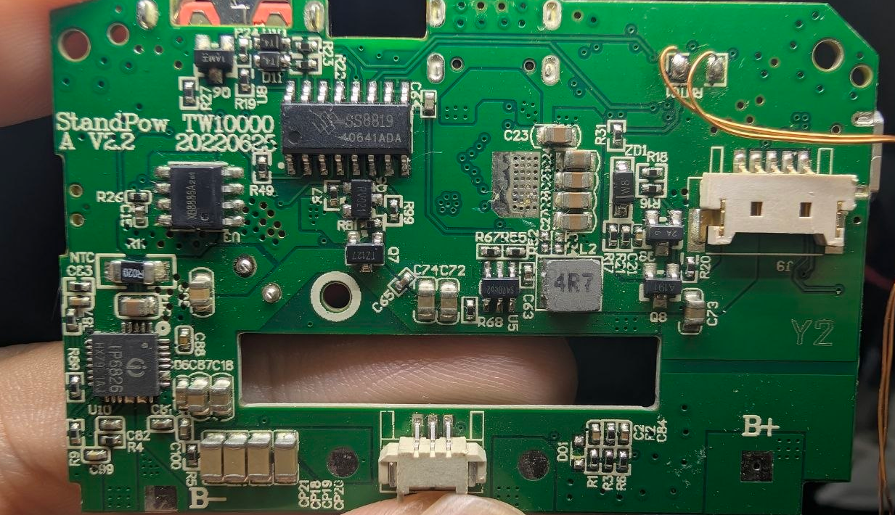

# IP6826-dat

- [[IP6826-dat]] - [[IP5328-dat]] - [[power-wireless-dat]] - [[power-bank-dat]]

15W wireless charging transmitter SoC supporting PD input

datasheet == [[IP6826-datasheet.pdf]]

## build 

- [[XB8886-dat]]

- [[SINH-dat]] - [[SS8819-dat]] - [[IP6826-dat]] - [[MCU-dat]] 

unknown

RV021

tz127

- [[TMI-dat]] - [[STI3470-dat]] - [[dcdc-down-dat]] - [[IP6826-dat]] == `S47B`

## ref 

