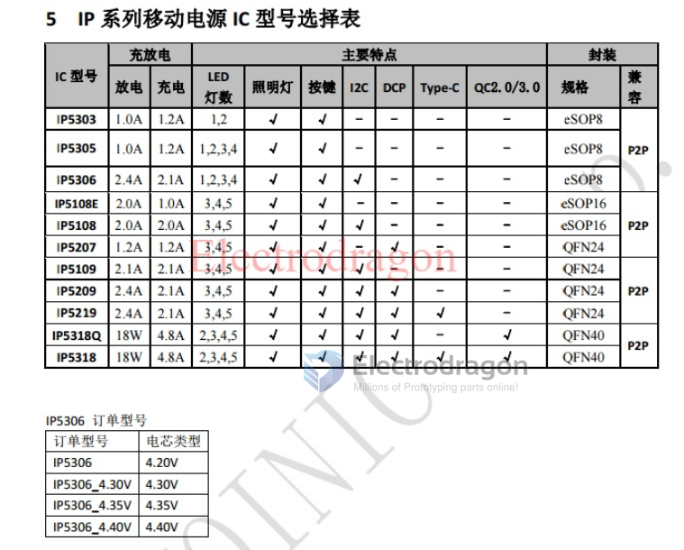

# injoinic-dat

https://w.electrodragon.com/w/Injoinic

- [[IP5356-dat]] - [[QC-charge-dat]]

- [[IP2326-dat]] - [[injoinic-dat]]

- [[IP236x-dat]]

- [[IP5306-dat]]

- IP2721 - TYPEC/PD2.0/PD3.0 Physical Layer IC for USB TYPEC input Interfaces

- [[IP6518-dat]] - 支持全协议快充45W车充IC芯片 封装QFN24

- [[IP6351-dat]] - IP6351S IP/英集芯一级代理小风扇驱动电源芯片带移动电源自然风

- [[IP3012-dat]]

## Chip Series 

## ref 

- [[injoinic]]

- [[m]]