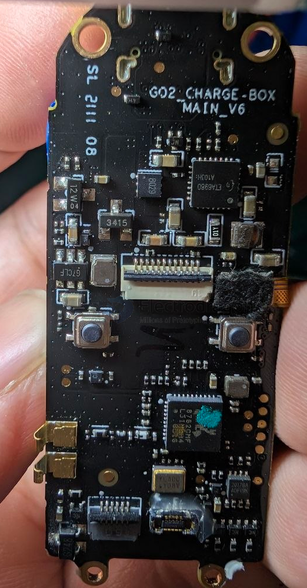
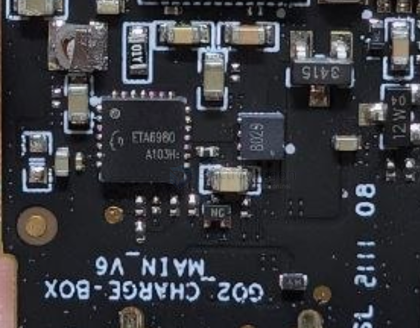
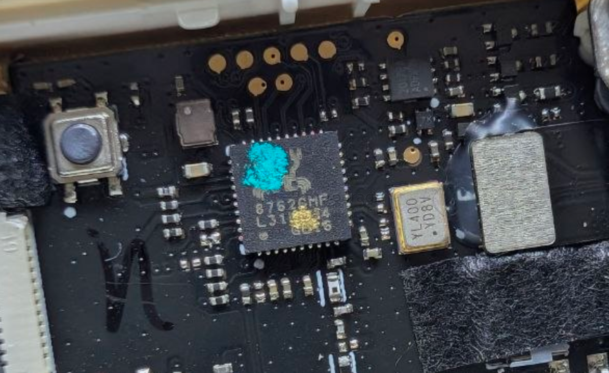
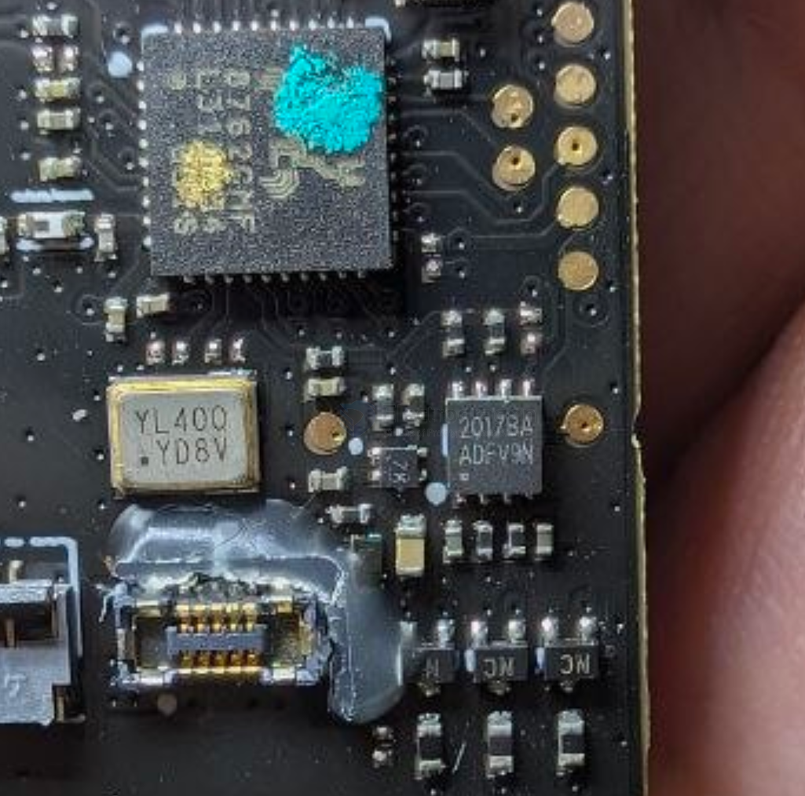
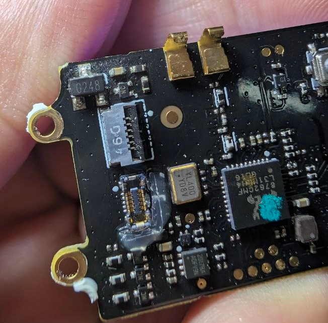
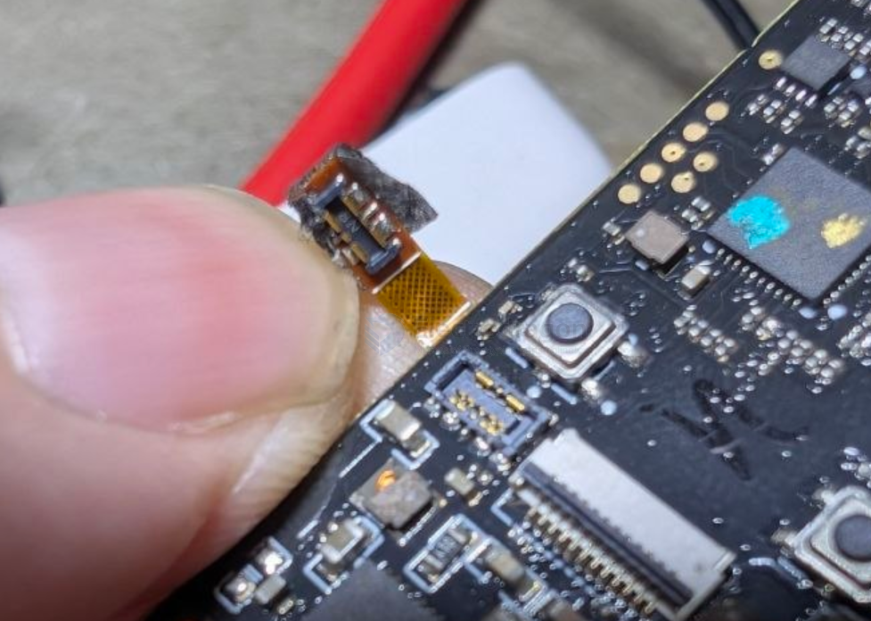
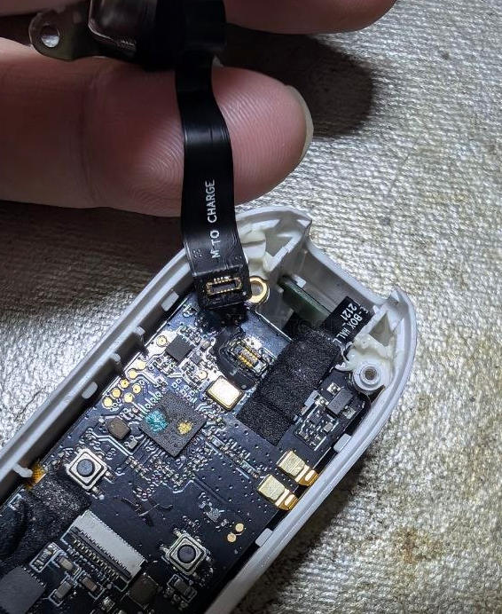
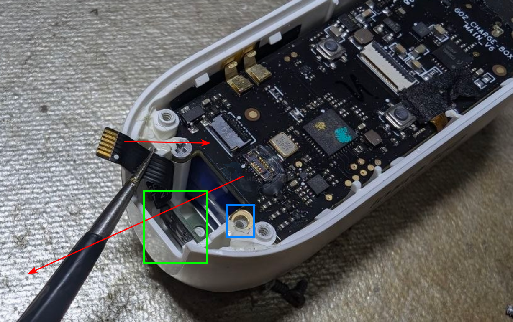
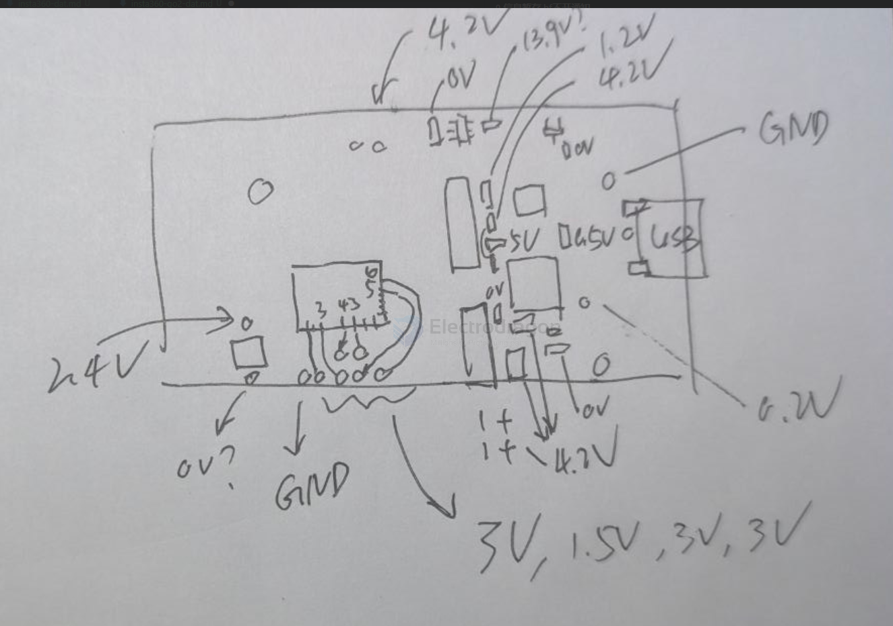

# insta360-go2-dat

- [[insta360-go2-dat]] - [[insta360-dat]]

- [[ETA6980-dat]] - [[ETA-solutions-dat]]

8029 - [[mosfet-dat]]

3415 - [[mosfet-dat]]

G7CLF - high voltage provider chip - [[SG-micro-dat]] - [[SGM3752-dat]] 

12W04 12W 04 - [[mosfet-dat]] - [[2N7002-dat]]

8762 - [[RTL8762-dat]] - [[realtek-dat]]

2017BA - [[CW2017-dat]] - [[cellwise-dat]] - [[voltmeter-dat]]

G248 SOT23-3 - [[GH1248-dat]] - [[golden-chip-dat]] - [[sensor-hall-dat]] 

battery connector 

- - +
- - +

upper case cable - [[cable-FPC-dat]]

header part 

## test 

## ref 

