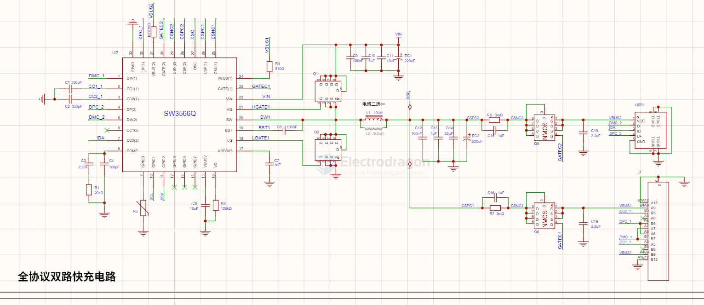

# SW3566-dat

- [[SW3566-dat]] - [[ismartware-dat]]

- [[USB-PD-dat]] - [[USB-sniffer-dat]]

SW3566是一款集成7ABuck控制器，支持140W（28V@5A）功率输出，且支持PD3.1等多快充协议的 C+C 双口 SoC。SW3566 内嵌 ARM Cortex-M0 内核，集成 Type-C 接口逻辑，PD 3.1 PHY，UFCS PHY，SCP/AFC PHY，TFCP PHY 以及 QC/PE/SFCP等快充协议检测电路，外围只需少量的器件，即可组成完整的高性能的C+C双口快速充电解决方案。

## build 

SCH 1 

- [[display-dat]] - [[LCD-SPI-dat]] - [[ESP32-C3-dat]] - via [[I2C-dat]] to [[SW3566-dat]]

## ref 

