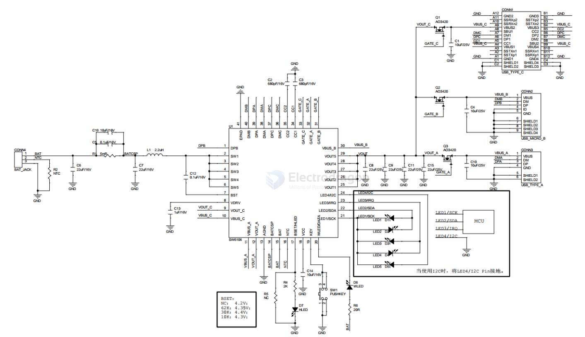

# SW6106-dat

- [[power-bank-dat]] - [[battery-charger-dat]] - [[battery-charge-boost-dat]] - [[fast-charge-protocols-dat]] - [[SW6106-dat]]

The SW6106 is a highly integrated power management IC for fast charge power bank application.
It integrates 4A switching charger, 18W synchronous boost, PD/QC/AFC/FCP/PE/SFCP fast charge
protocol, fuel gauge and power controller. With simple external components, The SW6106 provides
a turn-key high efficiency solution for fast charge battery management.

2. Applications
• Power Bank
• Battery Powered Device
3. Features
• Switching Charger
➢ Current up to 4A , Efficiency up to 96%
➢ Support 4.2/4.3/4.35/4.4 Battery
Voltage
➢ Support Battery NTC Protection
➢ Thermal Regulation
• Synchronous Boost
➢ Power up to 18W, Efficiency up to 95%
➢ Support Wire Drop Compensation
➢ Load Insert Detect and Auto Turn on
➢ Light Load Detect and Auto Turn off
• Output Fast Charge Protocol
➢ Support PD3.0/PD2.0
➢ Support QC3.0/QC2.0
➢ Support AFC
➢ Support FCP
➢ Support PE2.0/PE1.1
➢ Support SFCP
• Input Fast Charge Protocol
➢ Support PD3.0/PD2.0
➢ Support AFC
➢ Support FCP
• Type-C Interface
➢ Support USB Type-C Specification
➢ Support try.SRC Role
• BC1.2 Module
➢ Support BC1.2 DCP
➢ Support Apple & Samsung Device
• Lightning Decryption
➢ Support Lightning Decryption
• Fuel Gauge
➢ Include 12bit ADC
➢ Support Percent Display
➢ Support Various Battery Voltage
➢ Support 3~5 LEDs
➢ Automatic Recognition of LED
Number
• WLED Driver
➢ Support WLED Driver
• Fast Charge LED
➢ Support Fast Charge LED Driver
• Key Support
➢ Support Push Key
• Protection
➢ Input Over Voltage Protection
➢ Output Over Current Protection
➢ Output Short Protection
➢ Charger Over Time Protection
➢ Charger Over Voltage Protection
➢ Over Temperature Protection
• I2C Interface
• QFN-40(6x6mm) Package